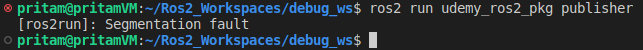

# Chapter 7.1 Debugging And Compiling In VS Code (C++)

In this lesson, we are going to go over debugging our ROS 2 code and setting up the VS Code to do our compiling. 

## 1. Creating The Bug

- Create a new folder **debug_ws** in the **Ros2_Workspaces** folder.
- Under **debug_ws,** create a new folder **src.**
- Copy the **udemy_ros2_pkg** package folder from the **Ros2_Workspaces/ros2_cpp_udemy_tutorial/src** folder - that we just created and compiled in previous lessons - to the newly created **Ros2_Workspaces/debug_ws/src** folder.
- Open your **VS Code** from the **debug_ws** folder.
- From the **VS Code terminal -** run `colcon build` command. This will build and compile our entire  **debug_ws** workspace and will create the **install** and **build** folders in our **debug_ws.**
- In the **VS Code Editor,** open the **publisher.cpp** file. ****
- In this step, we are going to create t**he bug**. Inside the **HelloWorldPubNode()** constructor of **publisher.cpp** file  — comment out the **publisher** object initiation code line i.e
    
    `publisher_ = this->create_publisher<std_msgs::msg::String>("hello_world", 10);`
    
    Save your files before moving ahead.
    
    **publisher.cpp** code after this last step:
    
    ```cpp
    #include <rclcpp/rclcpp.hpp>
    #include <std_msgs/msg/string.hpp>
    
    #include <chrono>
    #include <functional>
    
    using namespace std::chrono_literals;
    
    class HelloWorldPubNode : public rclcpp::Node
    {
    
    private:
        rclcpp::Publisher<std_msgs::msg::String>::SharedPtr publisher_;
    
        rclcpp::TimerBase::SharedPtr timer_;
    
        size_t counter = 0;
    
        void publish_hello_world()
        {
            auto message = std_msgs::msg::String();
            message.data = "hello world " + std::to_string(counter);
            publisher_->publish(message);  **//Error location.**
            counter++;
        }
    
    public:
        HelloWorldPubNode() : Node("hello_world_pub_node")
        {
            **// publisher_ = this->create_publisher<std_msgs::msg::String>("hello_world", 10);**
    
            timer_ = this->create_wall_timer(
                1s,
                std::bind(&HelloWorldPubNode::publish_hello_world, this));
        }
    };
    
    int main(int argc, char *argv[])
    {
        rclcpp::init(argc, argv);
    
        rclcpp::spin(std::make_shared<HelloWorldPubNode>());
    
        rclcpp::shutdown();
    
        return 0;
    }
    ```
    
   
    💡 One thing to notice here is that, even though we have created an **error** in our code here, our VS Code Editor does not show us any indication of the error.
    
    
- Now we will be compiling our workspace again. Run `colcon build` command from your **VS Code terminal**.
    
    While running the command, make sure that the terminal is opened in **Ros2_Workspaces/debug_ws** directory.
    
    We can see that, even though our code has **errors** — it gets compiled successfully. 
    
    💡 Right now, our terminal is not aware of the **udemy_ros2_pkg** package that is inside the **src** folder of our **debug_ws** workspace - which can be checked using `ros2 pkg list` command. So to do this, we have to **source** the **install/setup.bash** of our **debug_ws** workspace. Next step is precisely for this purpose.

- From the **Ros2_Workspaces/debug_ws** directory in our **VS Code terminal** run -
    
     `source install/setup.bash`
    
- Now run `ros2 run udemy_ros2_pkg publisher` command.
    
    Finally ! You are gonna see an **error** named **Segmentation fault.**
    
    
    

Now, we don't see any error in our VS Code Editor. We see any error while compiling/building our workspace. Yet when we try to run our **publisher** executable using the `ros2 run <package_name> <executable_name>` command - it gives us this **error message** - **Segmentation fault** - that is hardly any helpful at all - in finding out whats wrong with our code and the location of the error. 

So lets learn how we can better debug our ROS 2 code.

## 2. Debugging Our ROS 2 Code

- Run the command `colcon build --cmake-args -DCMAKE_BUILD_TYPE=RelWithDebInfo`  from **VS Code terminal**. While running the command, ensure that terminal is opened in **Ros2_Workspaces/debug_ws** folder.
    
    In this step, we are building our entire workspace again using the **colcon build** command while setting some **CMake arguments** for **debugging**.
    
- After the workspace is successfully built, run the following code:
    
    `ros2 run --prefix 'gdbserver localhost:3000' udemy_ros2_pkg publisher`
    

    💡 Here, we are using a popular debugger called **GNU Debugger (GDB)** while running our executable node **publisher.** 
    This will show us exactly where in our code the error is occurring.
    
    This command is used to run a ROS 2 package named "**udemy_ros2_pkg**" with the "**publisher**" node, and it also runs the command "**gdbserver localhost:3000**" as a **prefix**. The "**gdbserver**" command starts the **GNU Debugger (GDB)** **server** and tells the server to listen for connections on your **local machine (localhost)** on **port 3000**. So this command will run the **publisher** node of **udemy_ros2_pkg** package and also it will run the **gdbserver** command to create a server for another program i.e. the **GNU Debugger —** for listening to the **local machine (localhost)** on **port 3000** and connect to and interact with the code being run.

    

    💡 You will get error in the above command (as shown below) if you do not have **GDB server** installed on your Ubuntu system.

    

    To **install** the **GDB server,** open a **new terminal** & run the following commands:

    ```cpp
    sudo apt update
    sudo apt upgrade
    sudo apt install gdbserver
    ```

    This will install the **GDB server** on your Ubuntu machine.


    After successfully running the above code, you will see the following message on the **terminal:**

    

- Now we need to **configure** our **VS Code** to **communicate** with the **GDB server** that is listening to our **local machine (localhost)** on **port 3000.** So head back the **VS Code Editor,** and under the **debug_ws/.vscode** folder — make a new file **launch.json.**
    
    Add the below code to **launch.json** file:
    
    ```json
    {
        "version" :"0.2.0",
        "configurations": [
            {
                "name" : "C++ Debugger",
                "request" : "launch",
                "type" : "cppdbg",
                "miDebuggerServerAddress": "localhost:3000",
                "cwd" : "/",
                "program": "/home/pritam/Ros2_Workspaces/debug_ws/install/udemy_ros2_pkg/lib/udemy_ros2_pkg/publisher"
            }
        ]
    }
    ```
    
    You can find more information about Debugging on **VS Code Official Documentation Page On Debugging**.
    
    💡 This **launch.json** is a **launch configuration file** that **Visual Studio Code (VSCode)** during its **code debugging operations.** The file contains a single configuration, **"C++ Debugger"**, which is set to **launch** when the "**launch**" request is made. The configuration type is set to "**cppdbg**" , which is the **C++ debugger in VSCode**. The "**miDebuggerServerAddress**" is set to "**localhost:3000**", which specifies the address and port of the debugger server. This line connects our **VS Code C++ Debugger** to the **GDB server**. The "**cwd**" field, short for "**current working directory**," specifies the directory where the program being debugged should start running. The value is set to **"/"**, which is the root directory of the file system in **Ubuntu**. The "**program**" field **specifies the location of the executable program that is being debugged**, in this case it is "/**home/pritam/Ros2_Workspaces/debug_ws/install/udemy_ros2_pkg/lib/udemy_ros2_pkg/publisher**".
    This configuration file is used to launch and debug the **publisher** node of udemy_ros2_pkg package.
    
    
- **Save your work before proceeding** and now head back to publisher.**cpp** file in **VS Code Editor.**
    
    In **VS Code Editor menu bar** go to **Run** → Select **Start Debugging.**
    
    This will highlight the **error location** of the **Segmentation fault error** in **publisher.cpp** file and also open the **Debug Console** beside the terminal — with a bunch of text written on it.
    
    
    
     ****
    
    So in the picture, we can see that the **exception** occurs when we try to publish our message in **line no.23** of the **publisher.cpp** code.
    
- **To close the debugger**, click the **Stop(Shift+F5)** button at left most of **debugger button panel.**
    
    
    

## 3. Fixing The Bug

Now uncomment the `publisher_ = this->create_publisher<std_msgs::msg::String>("hello_world", 10);` line of **publisher.cpp** to remove the **bug**.

**Save your code.**

- Head back to the **VS Code Editor terminal**
- Rebuild the workspace using **colcon command:**
    
    `colcon build --cmake-args -DCMAKE_BUILD_TYPE=RelWithDebInfo`
    
    
    
- **Source** your **workspace** to **terminal:**
    
    `source install/setup.bash`
    
- Run the following code:
    
    `ros2 run --prefix 'gdbserver localhost:3000' udemy_ros2_pkg publisher`
    
- **Run** →**Start Debugging.**
    
    
    

    This time, you will see no activity from the **debugger** of **VS Code Editor** because we have fixed the bug in our code and our code is **bug-free**.

- Open a **new terminal in VS Code** and the following command:
    
    `ros2 node list`
    
    <aside>
    💡 On running this command, sometimes you may run into an error that looks something like this:
    
    ](Images/Chapter7.1/Untitled%207.png)
    
    *picture source:* [https://answers.ros.org/question/407132/ros2-node-list-crash-xmlrpcclientfault/](https://answers.ros.org/question/407132/ros2-node-list-crash-xmlrpcclientfault/)
    
    Now to solve this error:
    
    - Close all the **current running terminals** in **VS Code**.
    - Open a **new Ubuntu terminal** separate from **VS Code.**
    - In there, run the following commands:
        
        ```json
        ros2 daemon stop
        ros2 daemon start
        ```
        
    - Now close the **Ubuntu terminal** and go to **VS Code.**
    - Open a new terminal in **VS Code where our workspace is opened** and run the following commands again:
        
        ```bash
        colcon build --cmake-args -DCMAKE_BUILD_TYPE=RelWithDebInfo
        source install/setup.bash
        ros2 run --prefix 'gdbserver localhost:3000' udemy_ros2_pkg publisher
        ```
        
    - **Run** →**Start Debugging. (Important Step — Without this, the next step will not work)**
    - In the **VS Code terminal** run: `ros2 node list`
    - This time you will get no error further and will get the node list perfectly.
    </aside>
    

# 4. `colcon build --symlink-install`

- When you run `colcon build` command - all the **intermediate files** - that are generated during the building process of the **ROS2 workspace -** are stored inside the **build** folder. When a package is being built, the build system creates these intermediate files and then uses them to create the final product files, which are then copied to the **install** directory.
- All the files that are necessary for the execution of codes in a ROS2 workspace — are copied to the **install** **directory** — that includes things such as our **compiled node executables from build folder,** our **custom interface declarations** and **launch files.** The reason ROS2 does this is so that all of the necessary files for the system are located in one place, making it easier to run and manage the system.
- The **build** directory is used as a temporary location for these i**ntermediate files**, and it is usually not necessary to keep them after the building process is complete.
- If we look into the **build/udemy_ros2_pkg** folder of our **debug_ws** workspace, we will find the executable file **publisher** for our **src/udemy_ros2_pkg/src/publisher.cpp** file which got created upon running the `colcon build` command from **debug_ws** workspace folder in the terminal.


- Now when we ran the `colcon build` command from **debug_ws** workspace folder in the terminal — ROS2 also created a **copy** of this executable file **publisher** in the **install/udemy_ros2_pkg/lib/udemy_ros2_pkg** folder of the **debug_ws** workspace directory.


- Similarly, we can also find a **copy** of the **package.xml** file which was originally created at **debug_ws/src/udemy_ros2_pkg** directory of our **debug_ws** workspace (when we created the **udemy_ros2_pkg** package itself - inside the **debug_ws/src** directory from our terminal **-** using `ros2 pkg create udemy_ros2_pkg --build-type ament_cmake` command) - inside the **debug_ws/install/udemy_ros2_pkg/share/udemy_ros2_pkg** directory.


- Now everytime we run `colcon build` command to build our workspace, the **ROS2 build system** looks for any changes in these **important changeable files** like **publisher.cpp** and **package.xml** copies the updated files over to the **install** directory.
- But sometimes, you may just want to edit a single file such as the **package.xml** — **without having to rebuild the entire project/workspace**. Now that is where the command `colcon build --symlink-install` comes into play — this is an alternative way of building our workspace directory using **colcon.**
- This command tells **colcon** to build the packages in the workspace and create symbolic links in the install directory instead of copying the files. This can save disk space and improve the performance of the build process by avoiding duplicating files, and also allows for easier modification of the installed files.
- You can also specify the package or packages to build by adding the package name after the command, like this:
    
    `colcon build --symlink-install package_name1 package_name2`
    
    This will build package_name1 and package_name2 and create symbolic links in the install directory for them.
    
- Now to make sure our `colcon build --symlink-install` command gets executed properly — first we need to first we need to **delete** our current **build, install** and **log** directories from our **debug_ws** workspace folder.
    
    
    
- After deleting the **build, install** and **log** directories from our **debug_ws** workspace folder →  Open **new terminal** in **debug_ws** directory → Run `colcon build --symlink-install`
- Now if we go to **debug_ws/install/udemy_ros2_pkg/share/udemy_ros2_pkg** we can see the **package.xml** file with an **arrow symbol** which shows that this file is actually a **symbolic link** to the **debug_ws/src/udemy_ros2_pkg/package.xml** file and not an exact copy of it.
    
    Any changes we make in the **debug_ws/src/udemy_ros2_pkg/package.xml** file will be directly get reflected in **debug_ws/install/udemy_ros2_pkg/share/udemy_ros2_pkg/package.xml** file — without having to build the entire workspace.
    


- We can also see the same for **debug_ws/install/udemy_ros2_pkg/lib/udemy_ros2_pkg/publisher** file and **debug_ws/build/udemy_ros2_pkg/publisher** file.
    
    
    
    
    
- **For checking the location of the main source file**, we can use the `readlink file_name` command **on terminal** — **from the location of the symbolic link file** — that should be somewhere in the **install** directory.
    
    
    
    
    

# 5. Configuring Our VS Code For Building & Debugging Our ROS2 Code

- Head to your **VS Code Editor - debug_ws.**
- Under the **.vscode** folder of the **debug_ws** directory, create a new file named **tasks.json** in it.


- You can find more [Information on **Tasks** in the Official Documentation of VS Code](https://code.visualstudio.com/docs/editor/tasks)
- Add the following code to **tasks.json** file:
    
    ```bash
    {
        "version" :"2.0.0",
        "tasks" :[
            {
                "label": "build",
                "type": "shell",
                "command": "source /opt/ros/humble/setup.bash && colcon build --symlink-install"
            },
            {
                "label": "debug",
                "type": "shell",
                "command": "echo -e \"\n\nRun the node using the following command: \n\nros2 run --prefix 'gdbserver localhost:3000' <package_name> <executable_name> \n\nAnd modify the executable path in .vscode/launch.json file \n\" && source /opt/ros/humble/setup.bash && colcon build --symlink-install --cmake-args -DCMAKE_BUILD_TYPE=RelWithDebInfo"
            }
        ]
    }
    ```
    
- Now click on **Terminal → Run Build Task**
    
    
    
    or,
    
    click on **Terminal → Run Task →** choose **build**
    
    
    
    
    
    This will run the **command** under **build** label `source /opt/ros/humble/setup.bash && colcon build --symlink-install` on VS Code **shell/terminal.**
    
- Now click on **Terminal → Run Task →** choose **debug**
    
    
    
    
    
    This will run the **command** under **debug** label `echo -e \"\n\nRun the node using the following command: \n\nros2 run --prefix 'gdbserver localhost:3000' <package_name> <executable_name> \n\nAnd modify the executable path in .vscode/launch.json file \n\" && source /opt/ros/humble/setup.bash && colcon build --symlink-install --cmake-args -DCMAKE_BUILD_TYPE=RelWithDebInfo` on VS Code **shell/terminal.**
    

# 6. Some Useful ROS Extension Commands

- Go to **View** → **Command Palette**  or  Hit **Shift+Ctrl+P.**
- Type **ros.**
    
    
    
    Here you can see a couple of **ROS2** commands you can run using the **ROS Extension** of **VS Code**.
    

alternative