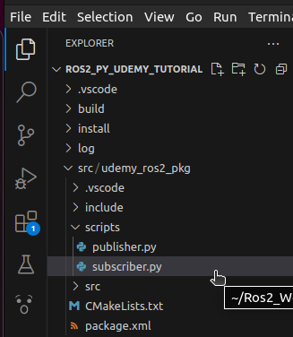

# Chapter 8.2 Creating ROS2 Subscriber (Python)

In this lesson, we are going to code a simple **subscriber node** using **Python** to receive and print the **string messages** sent by the **publisher.py** file (*that we wrote in the previous lesson 5.2*) over DDS.

- Open your **VS Code Editor** from the **ros2_py_udemy_tutorial** workspace folder.
- Create a new file **subscriber.py** inside **ros2_cpp_udemy_tutorial/src/udemy_ros2_pkg/scripts** directory from the VS Code **Explorer** Sidebar.
    
    
    

- Add the following code to the **subscriber.py** file:
    
    ```python
    import rclpy
    from std_msgs.msg import String
    from rclpy.node import Node
    
    class HelloWorldSubscriber(Node):
        # Constructor
        def __init__(self):
            
            # Calling Node class constructor. 
            super.__init__("hello_world_sub_node")  
            # Takes name of the node (String) as argument
            
            # Creating a Subscriber
            self.sub = self.create_subscription(String, 'hello_world', self.subscriber_callback, 10)   
            # self.sub is just an attribute of the HelloWorldSubscriber class 
            # create_subscription() is inherited from Node class. It takes 4 arguments.
            # String = Datatype of the messages for this subscription 
            # 'hello_world' = Name of the Topic (String) to subscribe to 
            #                 This name should be exactly same as 
            #                 the topic name set in the publisher file (publisher.py).
            # self.subscriber_callback = This is a function of HelloWorldSubscriber class 
            #                           which will run everytime our subcriber recieves a 
            #                           message from the publisher over DDS. This function 
            #                           defines how the messages recieved will get processed.
            #  
            # 10 = qos = quality of service = recived messages history depth of the subscriber.
        
        # Subscriber Callback Function  
        def subscriber_callback(self, msg): # argument 'msg' is the message object recieved 
                                            # from the publisher over 'hello_world' topic
            print ("Recieved:: "+msg.data)
                
                                                    
             
    
    def main(args=None):
        rclpy.init()                            # Starting ROS 2 DDS Communications systems
        my_sub =  HelloWorldSubscriber()        # Creating object of HelloWorldSubscriber class
        print("Waiting for data to be published...")
        
        try:
            rclpy.spin(my_sub)                  # When rclpy.spin() is called with a 'Node' instance ('my_sub' in this case) 
                                                # - it starts the event loop of the ROS 2 system. 
                                                # The event loop is a continuous loop that keeps the ROS 2 node active and 
                                                # responsive to various events, such as receiving messages, calling callbacks,
                                                # and handling other system tasks.
                                                # As long as the event loop is active, the subscriber node will continue 
                                                # recieving messages and keep calling the subsciber_callback() function 
                                                # for each of them. 
                                                # As long as the event loop is active, it blocks the further execution of 
                                                # any other code written below.
                                                # The event loop runs until it is explicitly terminated. 
                                                # In this code, the termination of the event loop is triggered by a 
                                                # KeyboardInterrupt error below. 
                                                # When a keyboard interrupt(ctrl + C) is detected, the execution of the 
                                                # event loop stops, and the program flow moves to the exception handling 
                                                # block.
                                                
        except KeyboardInterrupt:               # KeyboardInterrupt error is caused on pressing (ctrl + C) to explicitly  
                                                # terminate a process/operation going on in the console/terminal.
            print("Terminating subscriber...")
            my_sub.destroy_node()               # Destroying the node 
            
            
    if __name__ == '__main__':
        main()
    ```
    

- To run this file from your **VS Code,** (while keeping the **subscriber.py** file ***opened & in-focus*** in VS Code) click on the **Run Python File** option at the **top-right corner** of your VS Code Window.
    
    
    
- **Alternatively**, take **any** terminal **→** navigate to the address: **Ros2_Workspaces/ros2_py_udemy_tutorial/src/udemy_ros2_pkg/scripts →** run the **subscriber.py** script using the command `python3 subscriber.py`
    
    
    

- As of now, our **subscriber.py** script is ***succesfully running*** and the node **hello_world_sub_node** is listening for any messages over the topic **hello_world.**
    
    
    
    *(Opened a new terminal and ran the command `ros2 node list` to check if **hello_world_sub_node** is up and active)*
    
- Let us now run our **publisher.py** (**hello_world_pub_node**) file to publish messages over DDS on topic **hello_world,** so that our **hello_world_sub_node** can listen to those messages . (*publisher.py file was created in lesson 5.2*)
- **Keep the terminal running *subscriber.py file* open.**
- Open a **new terminal →** navigate to the address: **Ros2_Workspaces/ros2_py_udemy_tutorial/src/udemy_ros2_pkg/scripts →** run the **publisher.py** script using the command `python3 publisher.py`
    
    
    

As you can see from the terminal picture above, our **hello_world_sub_node** (*subscriber.py*) immediately started **recieving** messages over the topic **hello_world** and **printing** them as soon as our **hello_world_pub_node** *(publisher.py)* started **running** and **publishing** those messages on **DDS** over the topic **hello_world**.