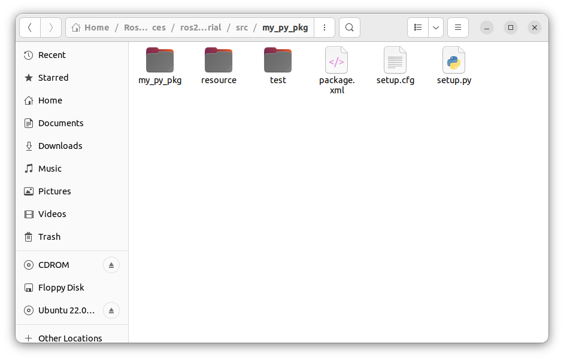

# Chapter 8.3 Configuring Packages (Python)

In the previous lessons, we have created our own ROS2 Python **Publisher** node (*publisher.py*) and **Subscriber** node (*subscriber.py*) which were able to communicate with each other using ROS2 **DDL.**

To run these **python nodes** we would

- open a terminal
- go to the **scripts** folder of our **udemy_ros2_pkg** package (from the terminal)
- and run the **specific** python script using `python3 name_of_the_file` terminal command.

In this lesson, we will be looking at how we can configure our ROS2 package (*udemy_ros2_pkg*) so that we we can to **run our nodes** (*publisher.py & subscriber.py*) without having to navigate to the package’s **ros2_py_udemy_tutorial/src/udemy_ros2_pkg/scripts** directory every time - from any terminal opened from **ros2_py_udemy_tutorial** workspace folder - using **`ros2 run`** terminal command. 

## Configuring Our **`ament_cmake`** Build-Type Package

In a previous lesson, we created the **udemy_ros2_pkg** package and specified the **build-type** as **ament_cmake** in the terminal command: `ros2 pkg create udemy_ros2_pkg --build-type ament_cmake`. This tells ROS2 to compile our package based on the instructions specified in our package’s **CMakeLists.txt** file.

**CMakeLists.txt** file is primarily designed for adding **C** & **C++** codes to the package configuration.  However, with a few small tweaks and adjustments it can also incorporate **Python** scripts in it.

So let us go ahead and configure our **udemy_ros2_pkg** package for running our nodes **publisher.py** and **subscriber.py** without having to navigate to the package’s **ros2_py_udemy_tutorial/src/udemy_ros2_pkg/scripts** directory every time - from any terminal opened from **ros2_py_udemy_tutorial** workspace folder - using **`ros2 run`** terminal command.

- Open your **ros2_py_udemy_tutorial** workspace folder from VS Code IDE.
- Open **src/udemy_ros2_pkg/package.xml** file and add the following code to it.
    
    ```xml
    <!-- Add the below 2 dependencies - to configure .py scripts into the package. -->
    <!-- Added while configuring 'publisher.py' and 'subscriber.py' files into the 'udemy_ros_pkg' package -->
    <buildtool_depend>ament_cmake_python</buildtool_depend>
    <depend>rclpy</depend>
    ```
    
- Save the **package.xml** file and open **CMakeLists.txt** file.
- Add the following code to **CMakeLists.txt** file.
    
    ```cmake
    # find dependencies
    find_package(ament_cmake REQUIRED)
    # Adding the below 2 dependencies for configuring our python 
    # scripts stored inside /scripts folder into this package.
    find_package(ament_cmake_python REQUIRED) 
    find_package(rclpy REQUIRED) 
    
    ament_python_install_package(scripts)
    # The above line of code is used to specify that our package contains Python scripts
    # inside a "Python Package Folder" named "scripts". 
    # It is a command provided by the ROS2 build system (ament) to configure 
    # the installation of Python packages.
    # A package folder is simply a python files folder containing a __init__.py file inside it.
    # Make sure that the "scripts" folder has atleast a blank file named __init__.py inside it. 
    
    # Specifying our python scripts.
    install(PROGRAMS
      scripts/publisher.py
      scripts/subscriber.py
      DESTINATION lib/${PROJECT_NAME}
    )
    ```

    > 💡 **NOTE**: 
    **ament_package()** should always be the last line of your **CMakeLists.txt** file. You should not add any extra code below it.

- Lastly, since **ament_cmake** build-type packages are primarily meant for working with **C++** codes, we need to tell ROS explicitly about how we want to execute our Python scripts.
    
    So, **paste** the below line of code at the **top (*1st Line*)** of each of your Python scripts (*publisher.py & subscriber.py*) stored within your **scripts** folder that you want to run as a ROS node.
    
    ```
    #! /usr/bin/env python3
    ```
    
    **/usr/bin/env python3** is the **path/address** of the **Python** **Interpreter** installed in our **Ubuntu** system.
    

- Now we are done with our package configurations.
- **Building the Workspace:** Open a new terminal from the **ros2_py_udemy_tutorial** workspace directory and run the following command :
    
    ```bash
    colcon build 
    ```
    
- **Sourcing Workspace to the Terminal :** Take any terminal from the **ros2_py_udemy_tutorial** workspace and run the following command.
    
    ```bash
    source install/setup.bash
    ```
    
    - To check if our workspace has sourced properly with our terminal and that our terminal is now aware of our **ros2_py_udemy_tutorial** workspace and all of the packages inside it (currently only **udemy_ros2_pkg**) run the `ros2 pkg list` command from **the same terminal**. A long list of various ROS2 packages will appear and in that you should also see the name of our **udemy_ros2_pkg** package.
        
        ```bash
        ros2 pkg list
        ```
        
    - To get the list of executables provided by **udemy_ros2_pkg** package - run the following command from the **same terminal**:
        
        ```bash
        ros2 pkg executables udemy_ros2_pkg
        ```
        
    
- **Running the Publisher Node (*publisher.py*)** : Open a **new** terminal from the **ros2_py_udemy_tutorial** workspace directory and run the following commands:
    
    ```bash
    source install/setup.bash
    ros2 run udemy_ros2_pkg publisher.py
    ```
    
- **Running the Subscriber Node (*subscriber.py*)** : Open a **new** terminal from the **ros2_py_udemy_tutorial** workspace directory and run the following commands:
    
    ```bash
    source install/setup.bash
    ros2 run udemy_ros2_pkg subscriber.py
    ```
    

> 💡 **NOTE** : 
To build only a **specific** package when there are **multiple** packages in your **workspace** - run the following command from any terminal opened from your **workspace** directory: <br>
    `colcon build --packages-select specific_package_name`

# Configuring **`ament_python`** Build-Type Packages

This build-type is used when our package is/will be solely composed of only **python scripts**. **We cannot use C++ codes in a package of this build type.** However, `ament_cmake` build-type packages can incorporate **both Python & C++** codes in it and is therefore is a **more popular and widely used package format** among ROS Developers.

## Creating a new `ament_python` Package

- Create a new package using `ament_python` build-type named **my_py_pkg** inside your **ros2_py_udemy_tutorial/src** directory.
    
    ```bash
    ros2 pkg create my_py_pkg --build-type ament_python
    ```
    

- The folder structure of **my_py_pkg** package (*which is an `ament_python` build-type package*) looks like below:
    
    
    

- We will store all our **.py** **scripts** for the ***my_py_pkg* package** inside the **my_py_pkg folder** of this package (*same names*). You will also notice that the **my_py_pkg** folder (that is inside the **my_py_pkg** package) already contains an **__init__.py** file inside it.
    
    
    

- Open your **ros2_py_udemy_tutorial** workspace directory from your VS Code IDE.
- Copy and paste the files **publisher.py** & **subscriber.py** from the **udemy_ros2_pkg/scripts** folder into the **my_py_pkg/my_py_pkg** folder.
    
    
    

> 💡 Also, remove the `#! /usr/bin/env python3`  line of code from the top of each of these files (**publisher.py** & **subscriber.py** files inside **my_py_pkg/my_py_pkg** folder).

## Configuring the Package

- Add the following code to **package.xml** file of **my_py_pkg** package:
    
    ```xml
    <!-- Adding these dependencies for configuring .py scripts created inside this package. -->
    <exec_depend>rclpy</exec_depend>
    <exec_depend>std_msgs</exec_depend>
    <!-- Add dependencies for any other message types you will use below. -->
    ```
    

- Add the following code to **setup.py** file of **my_py_pkg** package:
    
    ```python
    entry_points={
            'console_scripts': [
                # "executable_name = pkg_name.script_name:main_func_name"
                "my_publisher = my_py_pkg.publisher:main",
                "my_subscriber = my_py_pkg.subscriber:main",
            ],
        },
    ```
    

## **Building the Workspace**

We will not build the entire workspace of **ros2_py_udemy_tutorial** again. Instead, we will build only the my **my_py_pkg,** selectively from the workspace directory.

Open a new terminal from the **ros2_py_udemy_tutorial** workspace directory and run the below command.

```bash
colcon build --packages-select my_py_pkg
```

## Running the Publisher Node

Open a new terminal from the **ros2_py_udemy_tutorial** workspace directory and run the below commands:

```bash
source install/setup.bash
ros2 run my_py_pkg my_publisher

# ros2 run package_name executable_name
```

## Running the Subscriber Node

Open a new terminal from the **ros2_py_udemy_tutorial** workspace directory and run the below commands:

```bash
source install/setup.bash
ros2 run my_py_pkg my_subscriber

# ros2 run package_name executable_name
```