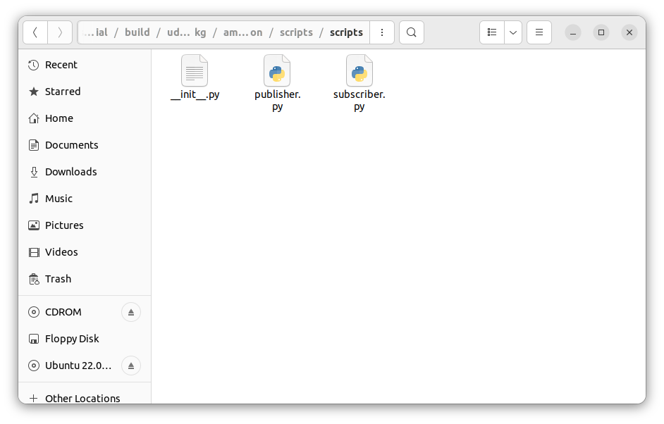

# Chapter 8.4. Configuring VS Code For Easy ROS2 Workspace Compilation (Python)

Till now we were building our workspace by

- opening a terminal in our workspace folder **ros2_py_udemy_tutorial** and
- running the `colcon build` command from the terminal.

In this lesson, we will be looking at how we can configure our VS Code IDE for an easy compilation of our workspace folder - such that we can compile our workspace in just a few mouse clicks !

Before actually diving into configuring VS Code for easy compilation of our ROS2 Workspace, we have to look at an *alternative* way of compiling/building our workspace .

## `colcon build --symlink-install` : An *alternative* way of compiling/building our workspace

- Normally, when we build a workspace we do it using `colcon build` command.
- When we run `colcon build` command - all the **intermediate files** - that are generated during the building process of the **ROS2 workspace -** are stored inside the **build** folder. When a package is **being built**, the build system creates these **intermediate files** and then uses them to create the **final product files**, which are then **copied** to the **install** directory.
- All the files that are necessary for the execution of codes in a ROS2 workspace — are copied to the **install** **directory** — that includes things such as our **compiled node executables from build folder,** our **custom interface declarations** and **launch files.** The reason ROS2 does this is so that all of the necessary files for the system are located in one place, making it easier to run and manage the system.
- The **build** directory is used as a temporary location for these i**ntermediate files**, and it is usually not necessary to keep them after the building process is complete.
- If we look into the **build/udemy_ros2_pkg/ament_cmake_python/scripts/scripts** folder of our **ros2_py_udemy_tutorial** workspace, we will find a copy of every file that is present right now inside the **src/udemy_ros2_pkg/scripts** folder of our workspace ( `publisher.py`,  `subscriber.py`,  `__init__.py` ) ---- which got created upon running the `colcon build` command from **ros2_py_udemy_tutorial**  workspace folder in the terminal.
    
    
    
- Now when we ran the `colcon build` command from **ros2_py_udemy_tutorial** workspace folder in the terminal — ROS2 also created **copies** of the important **udemy_ros2_pkg** package **executable files** (`publisher.py` and `subscriber.py`) inside the **install/udemy_ros2_pkg/lib/udemy_ros2_pkg** folder of the **ros2_py_udemy_tutorial** workspace directory.
    
    
    
- Similarly, we can also find a **copy** of the **package.xml** file of our **udemy_ros2_pkg** package inside the **install/udemy_ros2_pkg/share/udemy_ros2_pkg** directory of our **ros2_py_udemy_tutorial** workspace folder.
    
    
    
- Everytime we run `colcon build` command to build our workspace, the **ROS2 build system** scans all the packages inside the workspace looking for **any changes** in the **important original changeable files** of these packages (like **publisher.py, subscriber.py** and **package.xml** of **udemy_ros2_pkg** package) — and copies the **updated** **files** over to the **proper locations** inside **install** directory.
- But sometimes, you may just want to edit a single file such as the **publisher.py** — **without having to rebuild the entire project/workspace**. Now that is where the command `colcon build --symlink-install` comes into play — this is an alternative way of building our workspace directory using **colcon.**
- The `colcon build --symlink-install` command tells **colcon** to **build** the workspace and create **symbolic** **link files** for all the **important original changeable files** inside every **package** - organized properly within the **install** directory - instead of just copying these files directly into the install directory (as was in the case of simple `colcon build`). This can save disk space and improve the performance of the build process by avoiding duplicating files, and also allows for easier modification of the installed files.
- You can also specify the package or packages to build by adding the package name after the command, like this:
    
    ```bash
    colcon build --symlink-install package_name1 package_name2
    ```
    
- Now to make sure our `colcon build --symlink-install` command gets executed properly — first we need to first we need to **delete** our current **build, install** and **log** directories from our **ros2_py_udemy_tutorial** workspace folder.
    
    
    
- After deleting the **build, install** and **log** directories from our **ros2_py_udemy_tutorial** workspace folder →  Open **new terminal** in the workspace directory → Run `colcon build --symlink-install` command.
    
    
    
- Now if we go to **install/udemy_ros2_pkg/lib/udemy_ros2_pkg** folder of our workspace we can see the files *publisher.py & subscriber.py* with an **arrow symbol** which shows that these files are actually **symbolic links** to the files stored inside **ros2_py_udemy_tutorial/src/udemy_ros2_pkg/scripts** folder and not an exact copy of them.
    
    
    
    - **For checking the location of the main source files**, we can use the `readlink file_name` command from **any terminal** — opened from the **same location** as that of the symbolic link files - **Ros2_Workspaces/ros2_py_udemy_tutorial/install/udemy_ros2_pkg/lib/udemy_ros2_pkg**
        
        
        

- Any changes we make in the **src/udemy_ros2_pkg/scripts/publisher.py** file will directly get reflected in the **install/udemy_ros2_pkg/lib/udemy_ros2_pkg/publisher.py** file — without having to build the entire workspace.
- We can also see the same for **ros2_py_udemy_tutorial/install/udemy_ros2_pkg/share/udemy_ros2_pkg/package.xml** file and **ros2_py_udemy_tutorial/src/udemy_ros2_pkg/package.xml** file.

## The Problem With `--symlink-install` Build And Its Solution

- At this point we have successfully built our **ros2_py_udemy_tutorial** workspace using `colcon build --symlink-install` command.
- Open a **new terminal** in the **ros2_py_udemy_tutorial** workspace folder.
- In there, try running the **publisher.py** executable using `ros2 run` command:
    
    ```bash
    source install/setup.bash
    ros2 run udemy_ros2_pkg publisher.py
    ```
    
    
    

- You will get the **No executable found** as output.
- When we run the `ros2 run udemy_ros2_pkg publisher.py` command, ROS2 searches for the **`publisher.py` executable file** inside the **install/udemy_ros2_pkg/lib/udemy_ros2_pkg** folder of **ros2_py_udemy_tutorial** workspace. But what it gets instead is a **symbolic link file** to the actual executable **`publisher.py`** , which then points ROS to its actual destination file **src/udemy_ros2_pkg/scripts/publisher.py**.
- But here, since the workspace was built using `colcon build --symlink-install` command, all the **.py** files inside the **src/udemy_ros2_pkg/scripts** folder are **non-executable files —** by default.
- That is why we get the **No executable found** response in the terminal.


    > **💡 The problem with `symlink-install` build** : If we build our workspace using `colcon build --symlink-install` command, then all the **.py** files inside all the **src/package_name/scripts** folders of the workspace will be **non-executable** by default. So, we will not be able to run any of the **.py scripts** from any of the packages inside the workspace - because they are **non-executable** files.


- We can also check this by running the below commands on any terminal opened in **ros2_py_udemy_tutorial** workspace folder.
    
    ```bash
    source install/setup.bash
    ros2 pkg executables udemy_ros2_pkg
    
    ## Checking for executable files inside udemy_ros2_pkg package.
    ```
    
    
    
    From the terminal image we can see that the list of **udemy_ros2_pkg** executables is empty currently.
    
    That is because, since we have used `colcon build --symlink-install` command to build the package, all the **.py** files inside **src/udemy_ros2_pkg/scripts** folder of the workspace are currently **non-executable files —** by default.
    
- Another way of showing this is by navigating directly to **Ros2_Workspaces/ros2_py_udemy_tutorial/src/udemy_ros2_pkg/scripts** folder from any terminal and checking the list of files inside **scripts** folder through `ls` command.
    
    ```bash
    cd Ros2_Workspaces/ros2_py_udemy_tutorial/src/udemy_ros2_pkg/scripts
    ls
    ```
    
    
    
    - Now, simply observe the output for the `ls` command.
    - Currently, all the files inside **scripts** folder are non-executable files.
    - The way we know this is by the fact that - in our terminal - names of the **executable files** appear in **green colored font** and the names of **non-executable files** are appear in **white colored font**.
    
    <br>

    > **💡 In case of a simple `colcon build` type workspace, we do not get this error** because in this case **colcon automatically takes care** of this and ensures that the **.py** files inside **src/udemy_ros2_pkg/scripts** folder **are executable** and these are **directly copied** to the **install/udemy_ros2_pkg/lib/udemy_ros2_pkg** directory which will be referred by the `ros2 run` command for running various codes/executables from the workspace.

    <br>

- To fix this issue, we have to **change** the **publisher.py** file present inside the **src/udemy_ros2_pkg/scripts** folder from a ***non-executable file* into an *executable file.***
    
    We can do this using the `chmod +x file_name` terminal command.
    
    - So, open a new terminal and navigate to **Ros2_Workspaces/ros2_py_udemy_tutorial/src/udemy_ros2_pkg/scripts** folder.
    - From there, run the following command:
        
        ```bash
        chmod +x publisher.py
        
        # This will change the file permissions for publisher.py file and convert it to an executable.
        ```
        
    - To check if your **publisher.py** file has successfully converted into an executable or not, run the `ls` command from the same terminal. This will list all the contents of **udemy_ros2_pkg/scripts** folder.
        
        
        
    - As you can see from the picture that the **font-color** of **publisher.py** has changed to **green** - because **publisher.py** is changed to an executable now.
    - Also, files names **__init__.py** & **subscriber.py** are still written in **white colored fonts** because these files are still **non-executable files**.

# **Configuring VS Code For Easy ROS2 Workspace Compilation**

In this section, we will be automating our VS Code IDE to run the following commands for us - whenever we want to build our complete workspace :

- `source /opt/ros/humble/setup.bash`  : sourcing our ROS2 installation to the VS Code terminal.
- `colcon build --symlink-install` : This command will build our workspace in such a way that whenever we make some changes to any file from any of the packages in our workspace, those changes will get **immediately** reflected in the corresponding **symbolic link file** present inside the **install** directory our workspace — so that we do not have to keep building our workspace everytime we make some small change to any source file, to make the changes reflect in the install directory as well.
- `find . -wholename ‘./src/*.py’ -exec chmod +x {} \\;`  :
    - As we have seen in the previous section, that building our workspace using **colcon build --symlink-install** command has a **disadvantage/side-effect** and that is it sets all the **.py** files present inside the **scripts** folders of the packages as **non-executable** files.
    - In order to solve this problem, we used the `chmod +x file_name` terminal command **for that particular file that we want to convert into an executable**.
    - Using the command `find . -wholename ‘./src/*.py’ -exec chmod +x {} \\;` we are converting all of our **.py** files within the vicinity of the **src** folder of our **ros2_py_udemy_tutorial** workspace folder *(that covers .py files of all the packages within the workspace folder)* from being **non-executable** to **executable** files.

## Steps:

1. Open your **ros2_py_udemy_tutorial** workspace folder in your VS Code IDE.
2. From the **Explorer** section, create a new file named **tasks.json** inside the **.vscode** folder of your workspace.
3. Add following code to the file **.vscode/tasks.json** :
    
    ```json
    {
        "version" :"2.0.0",
        "tasks" : [
            {
                "label": "build",
                "type": "shell",
                "command": "source /opt/ros/humble/setup.bash && colcon build --symlink-install && find . -wholename './src/*.py' -exec chmod +x {} \\;" 
            }
        ]
    }
    ```
    

1. **Save** the file.
2. Now whenever you need to build your workspace - just go to **Terminal** tab of your VS Code Window and select **Run Build Task.**
    
    
    

1. Now, after doing the last step, if you open any terminal in the **src/udemy_ros2_pkg/scripts** folder of your **ros2_py_udemy_tutorial** workspace and run the `ls` command to see its contents - you will see the names of all the **.py** files in **green-colored-fonts —** that is because all the **.py** files in vicinity of the **src** folder of our workspace have been converted into  **executable** files by the command `find . -wholename './src/*.py' -exec chmod +x {} \\;` after building our workspace using `colcon build --symlink-install` command. All of this has been taken care of by our VS Code IDE under its **Build** task. 
    
    