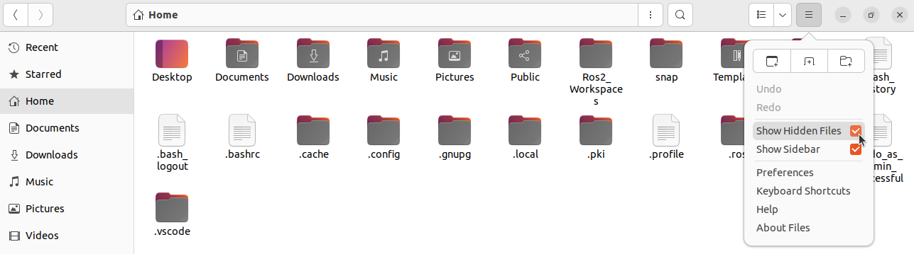

# Chapter 9.1. ROS2 Logging (C++)

In this lesson we will briefly talk about the **ROS 2 Logging System.**

1. Open the **Home** directory on your **Ubuntu** system → Check **Show Hidden Files**.

    

1. Open **.ros/log** folder.

    

1. Inside **/home/pritam/.ros/log** folder , we can see the **log files** that gets generated whenever we run our nodes (**publisher** & **subscriber**) in the terminal.

    

    For now, delete all the log files, so that we can create new fresh log files for each **publisher** node and **subscriber** node.

    

1. Open a **new terminal** inside the **ros2_cpp_udemy_tutorial** workspace and from there, run the **subscriber** node using the following commands:
    
    ```bash
    source install/setup.bash
    ros2 run udemy_ros2_pkg subscriber
    ```
    
2. Open a **new terminal** inside the **ros2_cpp_udemy_tutorial** workspace and from there, run the **publisher** node using the following commands:
    
    ```bash
    source install/setup.bash
    ros2 run udemy_ros2_pkg publisher
    ```
    
3. After both the nodes get successfully started - Use **Ctrl+C** on both the terminals to stop both the node operations.

    

    Notice the **^C[INFO] [1674548072.891387889] [rclcpp]: signal_handler(signum=2)** &    **^C[INFO] [1674548069.829954488] [rclcpp]: signal_handler(signum=2)**  lines that gets logged on the terminal after we hit **Ctrl+C** on both the terminals.

1. Now if we check the **log files** inside **/home/pritam/.ros/log** folder, we will find a log file for each of the **publisher** and **subscriber** nodes - which we ran just now on a terminal.

    

1. If we open the both the log files, we can see the **last log message** that we saw on the terminal of both **publisher** and **subscriber** nodes after hitting **Ctrl+C** to stop the terminal operations.
    
    
    
    
    
2. Now, the main purpose of a **log file** that gets generated while running a **node** on the **terminal** is to record every statement that gets logged on the terminal while running the node till the node operation is stopped using **Ctrl+C** on the terminal.
    
    But here, if you observe the log file for the **subscriber** node, we cannot see any **hello world** messages - sent by the publisher - that got logged on the **subscriber** terminal.
    
    That is because, till now we have been using the `std::cout` function to log our messages to the terminal. 
    
3. To use the **ROS 2 Logging System** for recording the **hello world** messages that are getting logged on the **subscriber** terminal, comment out the line of code `std::cout << msg.data << std::endl;` in the **subcriber.cpp** and the add the following code in the same place.
    
    ```cpp
    // std::cout << msg.data << std::endl;
    RCLCPP_INFO(this->get_logger(), msg.data.c_str());
    ```
    
4. Now **save** the file and **build** the workspace once again. 
5. Run the **publisher** and **subscriber** nodes.
    
    ```bash
    source install/setup.bash
    ros2 run udemy_ros2_pkg publisher
    ```
    
    ```bash
    source install/setup.bash
    ros2 run udemy_ros2_pkg subscriber
    ```
    
    **publisher** Terminal:
    
    
    
    **subscriber** Terminal:
    
    
    
    **publisher** log file:
    
    
    
    **subscriber** log file:
    
    
    
6. Apart from the **[INFO]** type of messages, **ROS 2 Logging System** also provides **[WARN], [ERROR]** & **[DEBUG]** types of messages.
    
    To see a demo of all different types of logging messages ROS2 provides, run the command `ros2 run logging_demo logging_demo_main` on a terminal.  
    
    
    
    Related **log file** in the **home/.ros** folder:
    
    
    
7. To also see the **[WARN], [DEBUG]** & **[ERROR]** types of messages along with the **[INFO]** type messages in the **subscriber** node terminal, add the following lines of code below `RCLCPP_INFO(this->get_logger(), msg.data.c_str());` in the **subscriber.cpp** file.
    
    ```cpp
    // std::cout << msg.data << std::endl;
    RCLCPP_INFO(this->get_logger(), msg.data.c_str());
    RCLCPP_WARN(this->get_logger(), msg.data.c_str());
    RCLCPP_DEBUG(this->get_logger(), msg.data.c_str());
    RCLCPP_ERROR(this->get_logger(), msg.data.c_str());
    ```
    
8. Now **save** the file and **build** the workspace once again. 
9. Run the commands:
    
    ```bash
    source install/setup.bash
    ros2 run udemy_ros2_pkg publisher
    ```
    
    ```bash
    source install/setup.bash
    ros2 run udemy_ros2_pkg subscriber
    ```
    
    **subcriber** terminal:
    
    
    
    Operation **log file** of **subscriber** node:
    
    
    
10. I**n order to see the [DEBUG] messages**, we have to initialize a **debug state** in the terminal. To do that, run the **subscriber** node using the following command:
    
    ```bash
    source install/setup.bash
    ros2 run udemy_ros2_pkg subscriber --ros-args --log-level hello_world_sub_node:=debug
    
    # In the ros2 run command above, hello_world_sub_node is the name of the node. 
    ```
    
    And start the **publisher** node once again:
    
    ```bash
    source install/setup.bash
    ros2 run udemy_ros2_pkg publisher
    ```
    
    **subcriber** terminal:
    
    
    
    Operation **log file** of **subscriber** node:
    
    
    
        
    ```cpp
    std::cout << msg.data << std::endl;
    //RCLCPP_INFO(this->get_logger(), msg.data.c_str());
    //RCLCPP_WARN(this->get_logger(), msg.data.c_str());
    //RCLCPP_DEBUG(this->get_logger(), msg.data.c_str());
    //RCLCPP_ERROR(this->get_logger(), msg.data.c_str());
    ```
        
    Since we do not want to generate **huge** **log files** every time we run our nodes in a terminal - we will keep the **logger lines of code** commented in the **subscriber.cpp** file as above.
    
    Finally, **build the workspace** to make the changes permanent.
        
## **subscriber.cpp Code:**

```cpp
#include <rclcpp/rclcpp.hpp>
#include <std_msgs/msg/string.hpp>

#include <iostream>

class HelloWorldSubNode : public rclcpp::Node
{
private:
    rclcpp::Subscription<std_msgs::msg::String>::SharedPtr subscriber_;
    void sub_callback(const std_msgs::msg::String &msg) const
    {
        std::cout << msg.data << std::endl;
        // RCLCPP_INFO(this->get_logger(), msg.data.c_str());
        // RCLCPP_WARN(this->get_logger(), msg.data.c_str());
        // RCLCPP_DEBUG(this->get_logger(), msg.data.c_str());
        // RCLCPP_ERROR(this->get_logger(), msg.data.c_str());
    }

public:
    HelloWorldSubNode() : Node("hello_world_sub_node")
    {
        subscriber_ = this->create_subscription<std_msgs::msg::String>(
            "hello_world",
            10,
            std::bind(&HelloWorldSubNode::sub_callback, this, std::placeholders::_1));
    }
};

int main(int argc, char * argv[])
{
    rclcpp::init(argc, argv);
    rclcpp::spin(std::make_shared<HelloWorldSubNode>());
    rclcpp::shutdown();

    return 0;
}
```