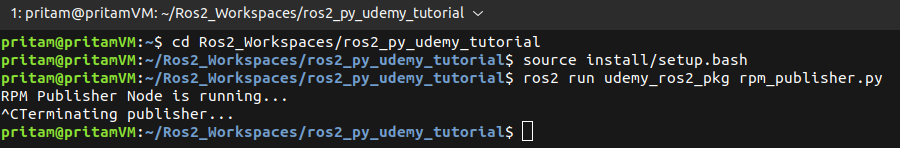

# Chapter 11.2. ROS2 Parameters(Python)

## Definition:

ROS2 parameters are **variables** used to store **values** that can be changed during **runtime** - from the **terminal**. ROS2 parameters are stored in a centralized parameter server, which allows nodes to access and modify them dynamically. ROS2 parameters can be of various types, including integers, floating-point numbers, strings, booleans, arrays, and more.

## Purpose/Use of Parameters

Let us once again take a look at the **rpm_subscriber.py** source code - which we created in **Project 1.2**

### **rpm_subscriber.py** code:

```python
#! /usr/bin/env python3

import rclpy
from std_msgs.msg import Float32
from rclpy.node import Node

DIAMETER = 10.0   # meters # Float

class RPMSubscriber(Node):
    def __init__(self):
        super().__init__("rpm_sub_node")  
        self.sub = self.create_subscription(Float32, 'rpm', self.subscriber_callback_func, 10)
        self.pub = self.create_publisher(Float32, 'speed', 10) 
        
    def subscriber_callback_func(self, msg): 
        SPEED = (msg.data * 3.14 * DIAMETER)/60   # SPEED = DISTANCE/TIME
                                                # DISTANCE = WHEEL CIRCUMFERENCE * RPM
                                                # TIME = 60 secs (1 minute)
        msg = Float32()
        msg.data = float(SPEED)
        self.pub.publish(msg)                                 
        
        
def main(args=None):
    rclpy.init()                            
    rpm_sub_node =  RPMSubscriber()       
    print("Waiting for rpm data to be published...")
    
    try:
        rclpy.spin(rpm_sub_node)                  
                                            
    except KeyboardInterrupt:              
        print("Terminating subscriber...")
        rpm_sub_node.destroy_node()               
        
if __name__ == '__main__':
    main()
```

Here, we have hard-coded the value of **DIAMETER** using the `DIAMETER = 10.0` line of code. Now, if we need to change the value of **DIAMETER** *(lets say we want to use this code for some different robot with wheels of different diameter)***,** we would usually think of **directly editing** **the hard-coded value of DIAMETER variable** in **rpm_subscriber.py** code i.e at `DIAMETER = 10.0` . But by using the **ROS Parameter Concept,** we can change the value of the **DIAMETER** that is being used by the **rpm_subscriber.py** code — without directly editing the source code file **rpm_subscriber.py** — from the **terminal** itself.

## Some Useful Terminal Commands for Working With ROS Parameters

1. Open a **new terminal** in the **workspace** folder → Run the **rpm_publisher.py** code using the below command.

    ```bash
    source install/setup.bash
    ros2 run udemy_ros2_pkg rpm_publisher.py
    ```

    

1. Open a **new terminal** in the **workspace** folder → Run the **rpm_subscriber.py** code using the below command.

    ```cpp
    source install/setup.bash
    ros2 run udemy_ros2_pkg rpm_subscriber.py
    ```

    

1. Open a **new terminal** and run the below command.

    ```cpp
    ros2 param list
    ```

    You will see a list of some **default** parameters for both the currently running nodes (/**rpm_pub_node** & /**rpm_sub_node**).

    

1. **To see the value of a parameter** run the following command from the **same terminal**:

    ```bash
    #ros2 param get <node_name> <param_name>
    ros2 param get /rpm_pub_node use_sim_time

    # Checking the value of use_sim_time - a default parameter of rpm_pub_node.
    ```

    

    You will see that **use_sim_time** has a **Boolean** type value which is currently set to **False** — by default — because this node is currently using the time of your local computer and **not** that of a simulation environment **.** You set the value of **use_sim_time** parameter to **true** if you want to use the time being generated by a **simulation** which you may have been running.

1. If you want to see more information about a parameter, use the following command from the **same terminal**:
    
    ```bash
    #ros2 param describe <node_name> <param_name>
    ros2 param describe /rpm_pub_node use_sim_time
    ```
    
    
    


## Implementing ROS2 Parameters Concept in rpm_subscriber.py Source Code

```python
#! /usr/bin/env python3

import rclpy
from std_msgs.msg import Float32
from rclpy.node import Node

DEFAULT_DIAMETER = 10.0   # meters

class RPMSubscriber(Node):
    def __init__(self):
        super().__init__("rpm_sub_node")  
        self.declare_parameter('wheel_diameter', DEFAULT_DIAMETER)      
        # Creating a parameter object named 'wheel_radius'and setting its default value equal to DEFAULT_DIAMETER variable.
        self.sub = self.create_subscription(Float32, 'rpm', self.subscriber_callback_func, 10)
        self.pub = self.create_publisher(Float32, 'speed', 10) 
        
        # print(self.get_parameter('wheel_diameter').get_parameter_value())     
        # printing the value of the 'wheel_diameter'  parameter object

        # Output:
        #*********
        # rcl_interfaces.msg.ParameterValue(type=3, bool_value=False, integer_value=0, double_value=10.0, string_value='', byte_array_value=[], bool_array_value=[], integer_array_value=[], double_array_value=[], string_array_value=[])
        
    def subscriber_callback_func(self, msg):
        wheel_diameter_param = self.get_parameter('wheel_diameter').get_parameter_value().double_value 
        # storing the 'double_value' attribute of the 'wheel_diameter' parameter object, inside the 'wheel_diameter_param' variable.
        # 'double_value' is the attribute of the 'wheel_diameter' parameter object which stores the default 'double' type value of DEFAULT_DIAMETER (= 10.0) variable.
        SPEED = (msg.data * 3.14 * wheel_diameter_param)/60   
        # SPEED = DISTANCE/TIME
        # DISTANCE = WHEEL CIRCUMFERENCE * RPM
        # TIME = 60 secs (1 minute)
        msg = Float32()
        msg.data = float(SPEED)
        self.pub.publish(msg)                                 
        
        
def main(args=None):
    rclpy.init()                            
    rpm_sub_node =  RPMSubscriber()       
    print("Waiting for rpm data to be published...")
    
    try:
        rclpy.spin(rpm_sub_node)                  
                                            
    except KeyboardInterrupt:              
        print("Terminating subscriber...")
        rpm_sub_node.destroy_node()               
        
if __name__ == '__main__':
    main()
```

1. Open a **new terminal** in the **workspace** folder → Run the **rpm_publisher.py** code using the below command.
    
    ```bash
    source install/setup.bash
    ros2 run udemy_ros2_pkg rpm_publisher.py
    ```
    
2. Open a **new terminal** in the **workspace** folder → Run the **rpm_subscriber.py** code using the below command.
    
    ```bash
    source install/setup.bash
    ros2 run udemy_ros2_pkg rpm_subscriber.py
    ```
    
3. Open a **new terminal** in the **workspace** folder and run the following commands:
    
    ```bash
    ros2 topic list 
    # Gives the list of currently running ros2 topics 
    
    ros2 topic echo /speed
    # /speed is the topic to which our rpm_sub_node 
    # is publishing its calculated speed values.
    ```
    
4. Open a **new terminal** and run the following commands:
    
    ```bash
    ros2 param list
    # To get the current list of active ros2 parameters in the
    # central parameters pool
    
    ros2 param get /rpm_sub_node wheel_diameter
    # To get the current value of parameter wheel_diameter
    
    ros2 param set /rpm_sub_node wheel_diameter 15.23
    # To set a new value for parameter wheel_diameter
    # The changes will reflect in the runtime itself.
    # Changing the wheel diameter is going to change the
    # calculated speed of the robot.
    # Check the new values of speed echoed by the /speed topic
    # in terminal 3.
    ```
    
    
    
    