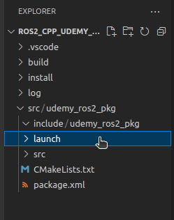

# Chapter 12.1. Launch Files (C++)

Up to this point, we have been running all of our ROS2 C++ nodes independently — with each node needing its own dedicated terminal to run. We have also had to open extra terminals for actions such as **—** setting the value of a parameter.

**Launch File** is a feature in **ROS2** that allows us to launch multiple nodes as well as additional independent terminal commands - all at the same time - from a single terminal - using one single **bash command.**

In this lesson, we will create a **launch file** to launch our **rpm_publisher** node along with some additional independent **bash commands**.

1. Open your **workspace** folder in **VS Code.**
2. Create a **new folder** named **launch** inside your **udemy_ros2_pkg** package folder.
    
    
    
3. **Right-click** on **launch → New File** → Name it **rpm_pub_node_launch.py** — this is a **python file** and inside this file, we are gonna add some **python code.**
    
    
    
4. Add the following code to the newly created **rpm_pub_node_launch.py** file:
    
    ```python
    from launch import LaunchDescription # This line imports the LaunchDescription class from the "launch" module, which is used to describe the overall launch configuration.
    from launch_ros.actions import Node # This line imports the Node class from the "launch_ros.actions" module, which is used to launch ROS nodes.
    from launch.actions import ExecuteProcess #  This line imports the ExecuteProcess class from the "launch.actions" module, which is used to run shell commands or launch external processes. 
    
    def generate_launch_description():
        
        # Below line returns an instance of the LaunchDescription class, which is initialized with a list of launch actions.
        return LaunchDescription([
    
            # Launch files can be used to run multiple nodes - all from a single terminal - with a single line of bash command.
            # Below block of code creates an instance of the "Node" class and launches a ROS2 node. The node is defined by its package name, executable name, node name, and parameter values (if we want to change the default parameter values, we can chnage them from here).
            Node(
                package="udemy_ros2_pkg",
                executable="rpm_publisher",
                name="rpm_pub_node",
                parameters=[
                    # if we want to change the default parameter values, we can chnage them from here
                    # {"parameter_name" : "custom_value"}
                    {"rpm_val":5.0},
                    # If you want, you can add more parameters to the list.
                ]
            ),
    
            # If you want, you can add more Node Objects to the list here.
    
            # Launch files can also be used to execute independent terminal commands - all at the same time - see below.
    
            # This line creates an instance of the ExecuteProcess class, which is used to run shell commands or launch external processes.
            ExecuteProcess(
                # Executing "ros2 node list" command - To check if our rpm_publisher node has been started properly. 
                cmd=["ros2", "node", "list"],
                # This line specifies where the output of the command should be displayed, in this case, on the "screen".
                output="screen" 
            ),
    
            ExecuteProcess(
                # Executing "ros2 topic list" command 
                cmd=["ros2", "topic", "list"],
                # Show the output to the screen.
                output="screen" 
            )
    
            # The two instances of the ExecuteProcess class run two different commands, "ros2 node list" and "ros2 topic list". These commands list all the ROS2 nodes and topics, respectively, running in the system.
        ])
    ```
    
5. **Save** the files and head over to the **CMakeLists.txt** file. 
6. Add the following code to the **CMakeLists.txt** file :
    
    ```c
    cmake_minimum_required(VERSION 3.8)
    project(udemy_ros2_pkg)
    
    if(CMAKE_COMPILER_IS_GNUCXX OR CMAKE_CXX_COMPILER_ID MATCHES "Clang")
      add_compile_options(-Wall -Wextra -Wpedantic)
    endif()
    
    # find dependencies
    find_package(ament_cmake REQUIRED)
    # uncomment the following section in order to fill in
    # further dependencies manually.
    # find_package(<dependency> REQUIRED)
    find_package(rclcpp REQUIRED)
    find_package(std_msgs REQUIRED)
    
    if(BUILD_TESTING)
      find_package(ament_lint_auto REQUIRED)
      # the following line skips the linter which checks for copyrights
      # comment the line when a copyright and license is added to all source files
      set(ament_cmake_copyright_FOUND TRUE)
      # the following line skips cpplint (only works in a git repo)
      # comment the line when this package is in a git repo and when
      # a copyright and license is added to all source files
      set(ament_cmake_cpplint_FOUND TRUE)
      ament_lint_auto_find_test_dependencies()
    endif()
    
    add_executable(publisher src/publisher.cpp) 
    ament_target_dependencies(publisher rclcpp std_msgs)
    
    add_executable(subscriber src/subscriber.cpp) 
    ament_target_dependencies(subscriber rclcpp std_msgs)
    
    add_executable(rpm_publisher src/rpm_publisher.cpp)
    ament_target_dependencies(rpm_publisher rclcpp std_msgs)
    
    add_executable(rpm_subscriber src/rpm_subscriber.cpp)
    ament_target_dependencies(rpm_subscriber rclcpp std_msgs)
    
    install(TARGETS 
            publisher 
            subscriber
            rpm_publisher
            rpm_subscriber
            DESTINATION lib/${PROJECT_NAME}
    )
    
    install(
      DIRECTORY
      launch
      DESTINATION share/${PROJECT_NAME}
    )
    
    ament_package()
    ```
    
7. **Save** all the files and **rebuild** the **workspace**.
8. To run the **launch file** from the **terminal →** Open a new terminal in the **workspace** folder and run the following **bash commands:**
    
    ```bash
    source install/setup.bash
    # ros2 launch <package_name> <file_name>
    ros2 launch udemy_ros2_pkg rpm_pub_node_launch.py
    ```
    
    
    
    Observe the highlighted portion of the output below:
    
    
    
    You can the **outputs** for the `ros2 node list` and `ros2 topic list` commands in the **terminal output**.
    
    In the highlighted portion, the **first three [INFO] messages** are stating that all the tasks entrusted to the **LaunchDescription** object i.e [1] starting the **rpm_publisher** node, [2] running the `ros2 node list` command, [3] running the `ros2 topic list` command — have been **started** successfully.
    
    Next in the queue -  **[ros2-2]** shows the output of the second task i.e [2] running the `ros2 node list` command & **[INFO][ros2-2]** message states that the task has been completed successfully.
    
    Next in the queue, there are three **[ros2-3]** messages which give the output of the third activity entrusted to **LaunchDescription** i.e [3] running the `ros2 topic list` command.
    
    And finally, the last **[INFO][ros2-3]** message states that the third activity is completed successfully.
    

1. To check if our **rpm_publisher** node is running properly - run the following commands from a **new terminal:**
    
    ```bash
    # Checking the list of active ros2 nodes
    ros2 node list
    
    # Checking the list of active ros2 topics
    ros2 topic list
    
    # Checking the value of **rpm_val** parameter of **rpm_publisher** node which we deliberately changed in the **rpm_pub_node_launch.py** file to the value of 5.0
    ros2 param get rpm_pub_node rpm_val
    
    # To see the messages published by rpm_publisher node through rpm topic
    ros2 topic echo rpm 
    ```
    
    