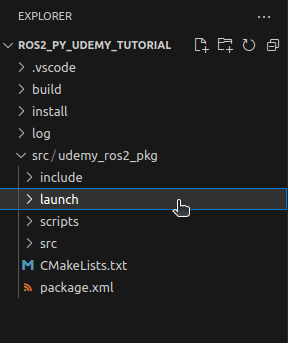

# Chapter 12.2. Launch Files (Python)

Up to this point, we have been running all of our ROS2 Python nodes independently — with each node needing its own dedicated terminal to run. We have also had to open extra terminals for actions such as **—** setting the value of a parameter.

**Launch File** is a feature in **ROS2** that allows us to launch multiple nodes as well as additional independent terminal commands - all at the same time - from a **single terminal** - using **one single** **bash command.**

In this lesson, we will create a **launch file** to launch our **rpm_publisher.py** node along with some additional independent **bash commands**.

1. Open your **ros2_py_udemy_tutorial** workspace folder in **VS Code.**
2. Create a **new folder** named **launch** inside your **udemy_ros2_pkg** package folder.
    
    
    
3. **Right-click** on **launch → New File** → Name it **rpm_pub_node.launch.py** — this is a **python file (.py)** and inside this file, we are gonna add some **python code.** *(The **.launch** part is added **by convention** as a tribute to the ROS1 launch files which ended with .launch . You can also name this file as **rpm_pub_node_launch.py** and that is perfectly acceptable.)*

    

1. Add the following code to the newly created **rpm_pub_node.launch.py** file:
    
    ```python
    # Necessary Imports 
    from launch import LaunchDescription
    from launch_ros.actions import Node     # This node class is different from the one we 
                                            # use for making publisher-subscriber nodes. 
    from launch.actions import ExecuteProcess
    
    # Below function is used by 'ros2 launch' command while running this launch file.
    def generate_launch_description():
        
        # This function returns a LaunchDescription object 
        # LaunchDescription object takes a list as its constructor argument.
        # This list consists of all the nodes and independent terminal commands that we want to 
        # run at once with this launch file.
        return LaunchDescription([
            
            # Details of an indivisual node we want to run 
            # are provided as arguments inside the Node object.
            # This 'Node' class is different from the one we 
            # use for making publisher-subscriber nodes.
            Node(
                package="udemy_ros2_pkg",                       # name of the package
                executable="rpm_publisher.py",                  # name of the executable
                name="rpm_pub_node",                            # name of the node
                # parameters=[ {"param_name":param_value} ]     # Setting value(s) for any parameter(s) of this node      
            ),
            
            # An ExecuteProcess object takes an Independent Teminal Command
            # that we want to run with this launch file.
            ExecuteProcess(
                cmd=["ros2", "topic", "list"],   # command : ros2 topic list
                output="screen"                 # Here we are telling to show the output 
                                                # of this command on the screen
            )
        ])
    ```
    
2. **Save** the files and head over to the **CMakeLists.txt** file. 
3. Add the following code to the **CMakeLists.txt** file :
    
    ```python
    cmake_minimum_required(VERSION 3.8)
    project(udemy_ros2_pkg)
    
    if(CMAKE_COMPILER_IS_GNUCXX OR CMAKE_CXX_COMPILER_ID MATCHES "Clang")
      add_compile_options(-Wall -Wextra -Wpedantic)
    endif()
    
    # find dependencies
    find_package(ament_cmake REQUIRED)
    # Adding the below 2 dependencies for configuring our python 
    # scripts stored inside /scripts folder into this package.
    find_package(ament_cmake_python REQUIRED) 
    find_package(rclpy REQUIRED)
    
    ament_python_install_package(scripts)
    # The above line of code is used to specify that our package contains Python scripts
    # inside a "Python Package Folder" named "scripts". 
    # It is a command provided by the ROS2 build system (ament) to configure 
    # the installation of Python packages.
    # A package folder is simply a python files folder containing a __init__.py file inside it.
    # Make sure that the "scripts" folder has atleast a blank file named __init__.py inside it. 
    
    # Specifying our python scripts.
    install(PROGRAMS
      scripts/publisher.py
      scripts/subscriber.py
      scripts/rpm_publisher.py
      scripts/rpm_subscriber.py
      DESTINATION lib/${PROJECT_NAME}
    )
    
    install(DIRECTORY
            launch
            DESTINATION share/${PROJECT_NAME}/
    )
    
    if(BUILD_TESTING)
      find_package(ament_lint_auto REQUIRED)
      # the following line skips the linter which checks for copyrights
      # comment the line when a copyright and license is added to all source files
      set(ament_cmake_copyright_FOUND TRUE)
      # the following line skips cpplint (only works in a git repo)
      # comment the line when this package is in a git repo and when
      # a copyright and license is added to all source files
      set(ament_cmake_cpplint_FOUND TRUE)
      ament_lint_auto_find_test_dependencies()
    endif()
    
    ament_package()
    ```
    
4. **Save** all the files and **rebuild** the **workspace**.
5. To run the **launch file** from the **terminal →** Open a new terminal in the **workspace** folder and run the following **bash commands:**
    
    ```bash
    source install/setup.bash
    # ros2 launch <package_name> <file_name>
    ros2 launch udemy_ros2_pkg rpm_pub_node.launch.py
    ```
    
    
    
    Observe the highlighted portion of the output below:
    
    
    
    The **[INFO] [rpm_publisher.py-1]** message are states that **rpm_publisher.py** node has been started successfully.
    
    Next in the queue - **[INFO]** **[ros2-2]** states that the `ros2 topic list` command has been ran successfully.
    
    Next in the queue, there are two **[ros2-2]** messages which give the output the `ros2 topic list` command.
    
    And finally, the last **[INFO][ros2-2]** message states that the second activity has completed successfully.
    
6. To check if our **rpm_publisher** node is running properly - run the following commands from a **new terminal:**
    
    ```bash
    #Checking the list of active ros2 nodes
    ros2 node list
    
    #Checking the list of active ros2 topics
    ros2 topic list
    
    #To see the messages published by rpm_publisher node through rpm topic
    ros2 topic echo rpm 
    ```
    
    
    

