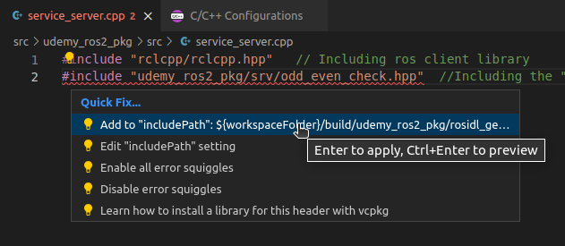

# Chapter 15. Creating A Service Server (C++)

In this lesson, we are going to create a **C++ Service Server Node** for the **OddEvenCheck.srv** custom service interface that we created in Chapter 13.

> 💡 **Service Server** <br>
The node which **processes** the **request message** sent from the **service client** and **gives** a **response message** back to the **service client**.


1. Open your **VS Code** in **Workspace** **Directory**.
2. Create a **service_server.cpp** file in the **src** directory of the **udemy_ros2_pkg** package folder.
3. Add the following code to **service_server.cpp** file:
    
    ```cpp
    // Including ros client library
    #include "rclcpp/rclcpp.hpp"
    // Including the "odd_even_check.hpp" header file located at 'install/udemy_ros2_pkg/include/udemy_ros2_pkg/udemy_ros2_pkg/srv' folder of our workspace directory - so that we can use our newly created 'udemy_ros2_pkg/srv/OddEvenCheck.srv' inteface file in our C++ code.
    #include "udemy_ros2_pkg/srv/odd_even_check.hpp"
    
    // typedef udemy_ros2_pkg::srv::OddEvenCheck OddEvenCheckSrv;
    
    class OddEvenCheckServiceServer : public rclcpp::Node
    {
    private:
        rclcpp::Service<udemy_ros2_pkg::srv::OddEvenCheck>::SharedPtr service_server_;
        // Creating the shared pointer to a rclcpp::Service class object for the udemy_ros2_pkg::srv::OddEvenCheck service interface - named service_server_
    
        void check_num_odd_even(const udemy_ros2_pkg::srv::OddEvenCheck::Request::SharedPtr request, udemy_ros2_pkg::srv::OddEvenCheck::Response::SharedPtr response)
        // This callback function takes two arguments:
        // 1. the request-message-object-shared-pointer 'const udemy_ros2_pkg::srv::OddEvenCheck::Request::SharedPtr request' - which contains the int64 field 'number' - and that is sent from the service client via "odd_even_check" service interface
        // 2. the response-message-object-shared-pointer 'udemy_ros2_pkg::srv::OddEvenCheck::Response::SharedPtr response' - which is currently a future object being fed to the service client as a result to its asynchronous service call.
        // Now this function fills up the 'response->decision' field as per the 'request->number' field - and sends the completed response object as result to the service client. 
        {
            int remainder = std::abs(request->number % 2);  // Taking the absolute value of request->number%2 result and storing it inside remainder.
    
            switch (remainder)
            {
            case 0:
                response->decision = "Even";
                break;
            case 1:
                response->decision = "Odd";
                break;
            };
        };
    
    public:
        OddEvenCheckServiceServer() : Node("odd_even_check_server_node")
        {
            service_server_ = this->create_service<udemy_ros2_pkg::srv::OddEvenCheck>(
                "odd_even_check",
                std::bind(&OddEvenCheckServiceServer::check_num_odd_even, this, std::placeholders::_1, std::placeholders::_2));
            // "create_service" method is applied on the "rclcpp::Node" class object (pointed by 'this')- which returns a rclcpp::Service<udemy_ros2_pkg::srv::OddEvenCheck>::SharedPtr object - and takes the service name "odd_even_check" and std::bind(callback_func, this, placeholders) as arguments.
            // The arguments std::placeholders::_1, and std::placeholders::_2 are copied as first and second arguments of the "&OddEvenCheckServiceServer::check_num_odd_even" callback function.
        };
    };
    
    // Driver Code:
    int main(int argc, char *argv[])
    {
        rclcpp::init(argc, argv);
        rclcpp::spin(std::make_shared<OddEvenCheckServiceServer>());  // Keep spinning this class until we manually close it.
        rclcpp::shutdown();
    
        return 0;
    }
    ```

    > 💡 To remove the red squiggle line below the 2nd include statement : Click on the line → Click on the bulb icon appearing at the top → Under the **Quick Fix** select the 1st option **“Add to “includePath”:$…”**
    
    
    
4. **Save** the code and move to the **CMakeLists.txt** file.
5. Add the following code to the **CMakeLists.txt** and **save** the file:
    
    ```cmake
    cmake_minimum_required(VERSION 3.8)
    project(udemy_ros2_pkg)
    
    if(CMAKE_COMPILER_IS_GNUCXX OR CMAKE_CXX_COMPILER_ID MATCHES "Clang")
      add_compile_options(-Wall -Wextra -Wpedantic)
    endif()
    
    # find dependencies
    find_package(ament_cmake REQUIRED)
    find_package(rclcpp REQUIRED)
    find_package(std_msgs REQUIRED)
    # Necessary import for using Custom Service Interfaces
    find_package(rosidl_default_generators REQUIRED)  
    
    if(BUILD_TESTING)
      find_package(ament_lint_auto REQUIRED)
      set(ament_cmake_copyright_FOUND TRUE)
      set(ament_cmake_cpplint_FOUND TRUE)
      ament_lint_auto_find_test_dependencies()
    endif()
    
    # We need to tell our ros2 compiler - the exact specifics of the newly created custom service interface file - that it needs to have the IDL Code generated for.
    # This line of code should always come before the add_excutable blocks, if you are planning to use the generated custom interface in these executables.
    rosidl_generate_interfaces(${PROJECT_NAME} "srv/OddEvenCheck.srv" ADD_LINTER_TESTS)                                                              
     
    # Set support for using custom interfaces in C++ from this package
    # This line should always be below the "rosidl_generate_interfaces()" code - otherwise it will produce compilation error.
    rosidl_get_typesupport_target(cpp_typesupport_target "${PROJECT_NAME}" "rosidl_typesupport_cpp")
    
    add_executable(publisher src/publisher.cpp) 
    ament_target_dependencies(publisher rclcpp std_msgs)
    
    add_executable(subscriber src/subscriber.cpp) 
    ament_target_dependencies(subscriber rclcpp std_msgs)
    
    add_executable(rpm_publisher src/rpm_publisher.cpp)
    ament_target_dependencies(rpm_publisher rclcpp std_msgs)
    
    add_executable(rpm_subscriber src/rpm_subscriber.cpp)
    ament_target_dependencies(rpm_subscriber rclcpp std_msgs)
    
    add_executable(service_client src/service_client.cpp)
    ament_target_dependencies(service_client rclcpp std_msgs)
    target_link_libraries(service_client "${cpp_typesupport_target}")
    
    add_executable(service_server src/service_server.cpp)
    ament_target_dependencies(service_server rclcpp std_msgs)
    target_link_libraries(service_server "${cpp_typesupport_target}")
    
    install(TARGETS 
            publisher 
            subscriber
            rpm_publisher
            rpm_subscriber
    		service_client
    		service_server
            DESTINATION lib/${PROJECT_NAME}
    )
    
    install(
      DIRECTORY
      launch
      DESTINATION share/${PROJECT_NAME}
    )
    
    ament_package()
    ```
    
6. Save all the files and **compile** the **workspace.**
7. To run the **service server** node, open a new terminal in the **workspace** directory and run the following commands:
    
    ```bash
    source install/setup.bash
    ros2 run udemy_ros2_pkg service_server
    ```
    
    
    
8. Open a **parallel** terminal and run the following command:
    
    ```bash
    ros2 service list
    #To see the list of active services
    ```
    
    
    

# Using the service_server Node WITHOUT The service_client Node:

We can check the **functionality** of our **service_server** node **without** executing the **service_client** node from the **terminal** itself. To do that, 

1. Ensure that the **service_server** node is already running on a different terminal. If not run the following commands from a **new** **terminal** in the **workspace** folder:
    
    ```bash
    source install/setup.bash
    ros2 run udemy_ros2_pkg service_server
    ```
    
    
    
2. Open a **2nd terminal** in the **workspace** folder and run the following commands:

    ```bash
    source install/setup.bash
    ros2 service call /odd_even_check udemy_ros2_pkg/srv/OddEvenCheck number:\ -7\
    # ros2 service call <service-name> <service-location> <service-request-variable> : \number-value-to-check-for-odd-even\
    ```

    

In the above figure, we can see that the value of the **response** message **decision** is **Odd** for the **number -7**.

# Using the service_server Node WITH The service_client Node:

1. Open a **new terminal** in the **workspace** folder and run the **service_server** node:
    
    ```bash
    source install/setup.bash
    ros2 run udemy_ros2_pkg service_server
    ```
    
2. Open a **2nd terminal** in the **workspace** folder and run the **service_client** node:
    
    ```bash
    source install/setup.bash
    ros2 run udemy_ros2_pkg service_client
    ```
    

    