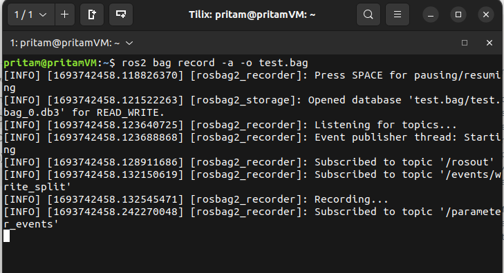

# Chapter 18. ROS2 Bag Files

- **Bag files** are used **to record (store) data** that is transmitted over **topics** in the ROS DDS Communication Ecosystem.
- Bag files are incredibly useful when it comes to robots, which are which are difficult to deploy and test, as well as review how your developed code responded to certain situations.
- In this lesson, we are gonna see how we can create our own **Bag files** and how we can use them to review robot performance.
- In order to create a **Bag** file, open a terminal from your **Home** directory (only in case of Ubuntu OS) and run the following command.
    
    ```bash
    ros2 bag record -a -o test.bag
    
    # '-a' flag is used to record information coming over all the active topics over ROS DDS.
    # If we do not wish to record the information coming over all the active topics and just wish to record certain specific topics, we can replace the '-a' flag with the names of the specific topics we wish to record. For example, if we wish to only record the information coming over the topics - /speed and /rpm - then '-a' flag, in the above command can be replaced with '/speed /rpm'. Resultant modified command will look like : "ros2 bag record /speed /rpm -o test.bag"
    # '-o' flag is used to specify the output bag file name.
    # 'test.bag' is the name of the final output bag file.
    # If we do not give any name to the bag file, the default name generated will be the current date and time when the bag file is being created. 
    ```
    
    
    
    Now the bag file **test.bag** has been created inside your **Home** directory and it has started listening to all and any currently active topics over the ROS DDS.
    
- The created bag file can be seen inside the **Home** directory with the same name (**test.bag**).
    
    
    
- As long as the last terminal is open and alive, the **test.bag** will continue to **listen and record data** over any **topic** that gets live over ROS DDS.
- Now, while keeping the **1st** **terminal** open, let us open a **2nd new terminal** and run the **rpm_publisher.py** node that we have written in some previous lesson. The **rpm_publisher.py** node publishes a constant value of a robot wheel’s **rpm**  over the topic **/rpm**. Run the below commands from the **2nd** terminal to start the **rpm_publisher.py** node :
    
    ```bash
    cd Ros2_Workspaces/ros2_py_udemy_tutorial/
    source install/setup.bash
    ros2 run udemy_ros2_pkg rpm_publisher.py
    ```
    
    
    
- **Keeping all the previous terminals alive**, open a **3rd terminal** and run the below commands to start the **rpm_subscriber.py** node. The **rpm_subscriber.py** node subscribes to the **/rpm** topic to get the robot wheel’s rpm value, and calculates the **speed** of the robot from this data and publishes it over another topic named **/speed**.
    
    ```bash
    cd Ros2_Workspaces/ros2_py_udemy_tutorial/
    source install/setup.bash
    ros2 run udemy_ros2_pkg rpm_subscriber.py
    ```
    
    
    
- To see the data that is being published over the topic **/rpm,** open a **4th new terminal** (while keeping the previous terminals alive) and run the below commands.
    
    ```bash
    ros2 topic list
    ros2 topic echo /rpm
    ```
    
    
    
- To see the data that is being published over the topic **/speed,** open a **5th new terminal** (while keeping the previous terminals alive) and run the below command.
    
    ```bash
    ros2 topic echo /speed
    ```
    
    
    

- **Close all the terminals (ctrl + C)** before proceeding any further.
    
    
    
- Now, whatever data that has been published over the topics **/rpm** and **/speed** from the start till this moment has been recorded in the **test.bag** file.
- To see the info about our bag file **test.bag**, open a **new terminal** (from the **Home** directory) and run the below command.
    
    ```bash
    ros2 bag info test.bag 
    ```
    
    
    
- To playback the bag file contents, run the below command from the same terminal as above step.
    
    ```bash
    ros2 bag play -l test.bag
    
    # '-l' flag signifies that once the contents of the bag file complete getting played, the contents will again start getting played from the first and will keep playing in an infinite loop.
    # '-l' flag is optional. If you do not want to play the bag file contents in an infinite loop, there is no need to mention '-l' in the command.
    ```
    
    
    
- **While keeping the previous terminal alive**, open a **2nd terminal** and run the following command.
    
    ```bash
    ros2 topic list
    ```
    
    
    
    You can see that, although the nodes, **rpm_publisher.py** and **rpm_subscriber.py** are no longer running, we can still see the topics **/rpm** and **/speed** as active over ROS DDS - that is by the virtue of **test.bag** file.
    
- To playback the contents of **/rpm** topic, **while keeping the terminal 1 alive**, open a **new 3rd terminal** and run the below command from it:
    
    ```bash
    ros2 topic echo /rpm 
    ```
    
    
    
- To playback the contents of **/speed** topic, **while keeping the terminal 1 alive**,  open a **new 4th terminal** and run the below command from it:
    
    ```bash
    ros2 topic echo /speed
    ```
    
    
    

And that is how we create a **Bag File** and play its contents later on.

---