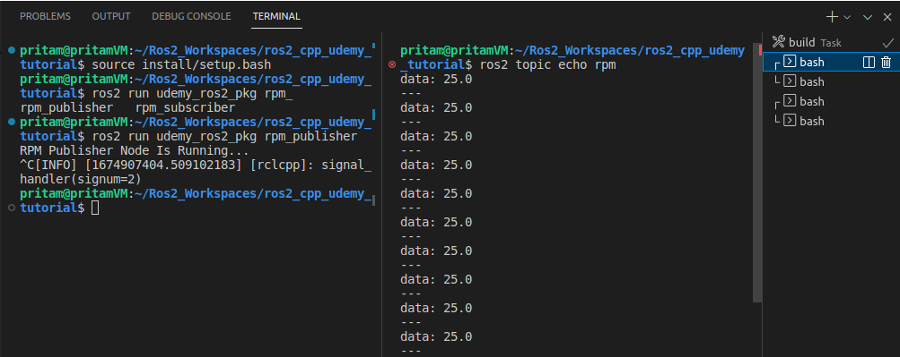

# Project 1.1. Publishers & Subscribers (C++)

# Problem Statement

For this project, let us consider a simple robot that has **4 wheels** and is moving at a **constant speed**.

For this robot, we are going to create 2 simple nodes.

The **first** node **publishes** the readings of a **tachometer sensor** ( which measures the **RPM** of the robot wheels - which can be any **constant** of your choice ) to a topic called **rpm**. 

Now the **second** node subscribes to the **topic** **rpm** and calculates the **speed** of the moving robot based on the **rpm** values and the **diameter** of the robot **wheels** (which is another constant) - and publishes this result to another new topic named **speed(m/s).** 

# **rpm_publisher.cpp** code:

```cpp
// Including the rclcpp library - for ros2 c++ functionality.
#include "rclcpp/rclcpp.hpp"
// Next we are importing the interface of the messages we are going to publish through this node.
#include "std_msgs/msg/float64.hpp"

#include "chrono"
#include "functional"

using namespace std::chrono_literals;

const double RPM_VALUE = 100.0;

class RpmPubNode : public rclcpp::Node
{
private:
    rclcpp::Publisher<std_msgs::msg::Float64>::SharedPtr rpm_publisher_;
    rclcpp::TimerBase::SharedPtr timer_;
    void publish_rpm()
    {
        auto rpm_value = std_msgs::msg::Float64();
        rpm_value.data = RPM_VALUE;
        rpm_publisher_->publish(rpm_value);
    }

public:
    RpmPubNode() : Node("rpm_pub_node")
    {
        rpm_publisher_ = this->create_publisher<std_msgs::msg::Float64>("rpm", 10);
        timer_ = this->create_wall_timer(1s, std::bind(&RpmPubNode::publish_rpm, this));
        std::cout<<"RPM Publisher Node Is Running..."<<std::endl;
    }
};

int main(int argc, char *argv[])
{
    rclcpp::init(argc, argv);
    rclcpp::spin(std::make_shared<RpmPubNode>());
    rclcpp::shutdown();
    return 0;
}
```

# **rpm_subscriber.cpp** code:

```cpp
#include "rclcpp/rclcpp.hpp"
#include "std_msgs/msg/float64.hpp"

#include "iostream"
#include "math.h"  //For using the value of Pi - M_PI

const double wheel_radius = 12.5/100; //Converting 12.5cm to meters.  //float64 datatype is double in C++

class RpmSubNode : public rclcpp::Node
{
private:
    rclcpp::Subscription<std_msgs::msg::Float64>::SharedPtr rpm_subscriber_;
    rclcpp::Publisher<std_msgs::msg::Float64>::SharedPtr speed_publisher_;
    void calculate_and_pub_speed(const std_msgs::msg::Float64 &rpm_msg) const
    {
        auto speed_msg = std_msgs::msg::Float64();
        //Speed[m/s] = { RPM (rev/min) * Wheel_Circumference(meters/rev) } / 60 seconds
        speed_msg.data = (rpm_msg.data * 2 * M_PI * wheel_radius)/60;
        speed_publisher_->publish(speed_msg);
    }

public:
    RpmSubNode() : Node("rpm_sub_node")
    {
        rpm_subscriber_ = this->create_subscription<std_msgs::msg::Float64>(
            "rpm",
            10,
            std::bind(&RpmSubNode::calculate_and_pub_speed, this, std::placeholders::_1)
            );

        speed_publisher_ = this->create_publisher<std_msgs::msg::Float64>("speed", 10);

        std::cout<<"RPM Subscriber Node Is Running..."<<std::endl;
    }
};

int main(int argc, char *argv[])
{
    rclcpp::init(argc, argv);
    rclcpp::spin(std::make_shared<RpmSubNode>());
    rclcpp::shutdown();

    return 0;
}
```

# Compiling And Executing The Nodes:

1. **To run the rpm_publisher node:**
    
    Open a new terminal in the **ros2_cpp_udemy_tutorial** workspace and run the following commands:
    
    ```cpp
    source install/setup.bash
    ros2 run udemy_ros2_pkg rpm_publisher
    
    ```
    
2. **To see the rpm messages published by the rpm_publisher** open a **parallel terminal** and run the following commands:
    
    ```cpp
    ros2 topic echo rpm
    ```
    
3. **To run the rpm_subscriber node:**
    
    Open a new terminal in the **ros2_cpp_udemy_tutorial** workspace and run the following commands:
    
    ```cpp
    source install/setup.bash
    ros2 run udemy_ros2_pkg rpm_subscriber
    
    ```
    
4. **To see the speed messages published by the  rpm_subscriber** open a **parallel terminal** and run the following commands:
    
    ```cpp
    ros2 topic echo speed
    ```
    



