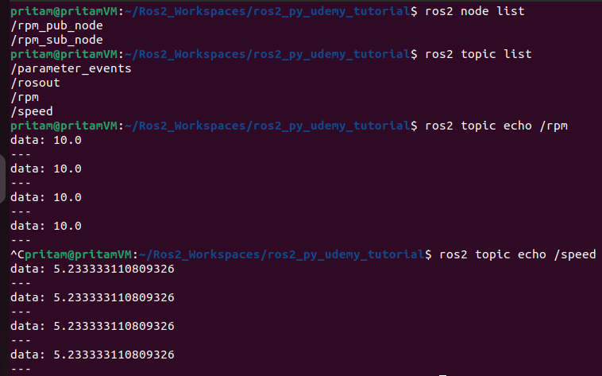

# Project 1.2. Publishers & Subscribers (Python)

# Problem Statement

For this project, let us consider a simple robot that has **4 wheels** and is moving at a **constant speed**.

For this robot, we are going to create 2 simple nodes.

The **first** node **publishes** the readings of a **tachometer sensor** ( which measures the **RPM** of the robot wheels - which can be any **constant** of your choice ) to a topic called **rpm**. 

Now the **second** node subscribes to the **topic** **rpm** and calculates the **speed** of the moving robot based on the **rpm** values and the **diameter** of the robot **wheels** (which is another constant) - and publishes this result to another new topic named **speed(m/s).** 

# **rpm_publisher.py** code:

```python
#! /usr/bin/env python3

import rclpy                        
from rclpy.node import Node         
from std_msgs.msg import Float32     
                                    
RPM = 10

class RpmPublisher(Node):    
    
    
    def __init__(self):
        super().__init__("rpm_pub_node")                                                                              
        self.pub = self.create_publisher(Float32, 'rpm', 10)            
        self.counter = 0                            
        self.timer = self.create_timer(0.5, self.rpm_publisher_callback_func)   
       
    def rpm_publisher_callback_func(self):
        msg = Float32()                                  
        msg.data = float(RPM) 
        self.pub.publish(msg)                          
        self.counter += 1 
                                     
def main(args=None):
    rclpy.init()                           
    my_pub =  RpmPublisher()         
    print("RPM Publisher Node is running...")
    
    try:
        rclpy.spin(my_pub)                  
                                            
    except KeyboardInterrupt:               
        print("Terminating publisher...")
        my_pub.destroy_node()               

if __name__=='__main__':  
    main()
```

# **rpm_subscriber.py** code:

```python
#! /usr/bin/env python3

import rclpy
from std_msgs.msg import Float32
from rclpy.node import Node

PI = 3.14
DIAMETER = 10   # meters

class RPMSubscriber(Node):
    def __init__(self):
        super().__init__("rpm_sub_node")  
        self.sub = self.create_subscription(Float32, 'rpm', self.subscriber_callback_func, 10)
        self.pub = self.create_publisher(Float32, 'speed', 10) 
        
    def subscriber_callback_func(self, msg): 
        SPEED = (msg.data * PI * DIAMETER)/60   # SPEED = DISTANCE/TIME
                                                # DISTANCE = WHEEL CIRCUMFERENCE * RPM
                                                # TIME = 60 secs (1 minute)
        msg = Float32()
        msg.data = float(SPEED)
        self.pub.publish(msg)                                 
        
        
def main(args=None):
    rclpy.init()                            
    rpm_sub_node =  RPMSubscriber()       
    print("Waiting for rpm data to be published...")
    
    try:
        rclpy.spin(rpm_sub_node)                  
                                            
    except KeyboardInterrupt:              
        print("Terminating subscriber...")
        rpm_sub_node.destroy_node()               
        
if __name__ == '__main__':
    main()
```

# **CMakeLists.txt**

```cmake
cmake_minimum_required(VERSION 3.8)
project(udemy_ros2_pkg)

if(CMAKE_COMPILER_IS_GNUCXX OR CMAKE_CXX_COMPILER_ID MATCHES "Clang")
  add_compile_options(-Wall -Wextra -Wpedantic)
endif()

# find dependencies
find_package(ament_cmake REQUIRED)
# Adding the below 2 dependencies for configuring our python 
# scripts stored inside /scripts folder into this package.
find_package(ament_cmake_python REQUIRED) 
find_package(rclpy REQUIRED)

ament_python_install_package(scripts)
# The above line of code is used to specify that our package contains Python scripts
# inside a "Python Package Folder" named "scripts". 
# It is a command provided by the ROS2 build system (ament) to configure 
# the installation of Python packages.
# A package folder is simply a python files folder containing a __init__.py file inside it.
# Make sure that the "scripts" folder has atleast a blank file named __init__.py inside it. 

# Specifying our python scripts.
install(PROGRAMS
  scripts/publisher.py
  scripts/subscriber.py
  **scripts/rpm_publisher.py
  scripts/rpm_subscriber.py**
  DESTINATION lib/${PROJECT_NAME}
)

if(BUILD_TESTING)
  find_package(ament_lint_auto REQUIRED)
  # the following line skips the linter which checks for copyrights
  # comment the line when a copyright and license is added to all source files
  set(ament_cmake_copyright_FOUND TRUE)
  # the following line skips cpplint (only works in a git repo)
  # comment the line when this package is in a git repo and when
  # a copyright and license is added to all source files
  set(ament_cmake_cpplint_FOUND TRUE)
  ament_lint_auto_find_test_dependencies()
endif()

ament_package()
```

# package.xml

```xml
<?xml version="1.0"?>
<?xml-model href="http://download.ros.org/schema/package_format3.xsd" schematypens="http://www.w3.org/2001/XMLSchema"?>
<package format="3">
  <name>udemy_ros2_pkg</name>
  <version>0.0.0</version>
  <description>TODO: Package description</description>
  <maintainer email="pritam@todo.todo">pritam</maintainer>
  <license>TODO: License declaration</license>

  <buildtool_depend>ament_cmake</buildtool_depend>

  <!-- Add the below 2 dependencies - to configure .py scripts into the package. -->
  <!-- Added while configuring 'publisher.py' and 'subscriber.py' files into the 'udemy_ros_pkg' package -->
  <buildtool_depend>ament_cmake_python</buildtool_depend>
  <depend>rclpy</depend>

  <test_depend>ament_lint_auto</test_depend>
  <test_depend>ament_lint_common</test_depend>

  <export>
    <build_type>ament_cmake</build_type>
  </export>
</package>
```

# Compiling And Executing The Nodes:

1. **To run the rpm_publisher node:**
    
    Open a **new termina**l in the **ros2_py_udemy_tutorial** workspace and run the following commands:
    
    ```cpp
    source install/setup.bash
    ros2 run udemy_ros2_pkg rpm_publisher.py
    
    ```
    
2. **To run the rpm_subscriber node:**
    
    Open a **new terminal** in the **ros2_py_udemy_tutorial** workspace and run the following commands:
    
    ```cpp
    source install/setup.bash
    ros2 run udemy_ros2_pkg rpm_subscriber.py
    
    ```
    

1. Now let us run our nodes. Open a **new terminal** and **run the following commands.**
    
    