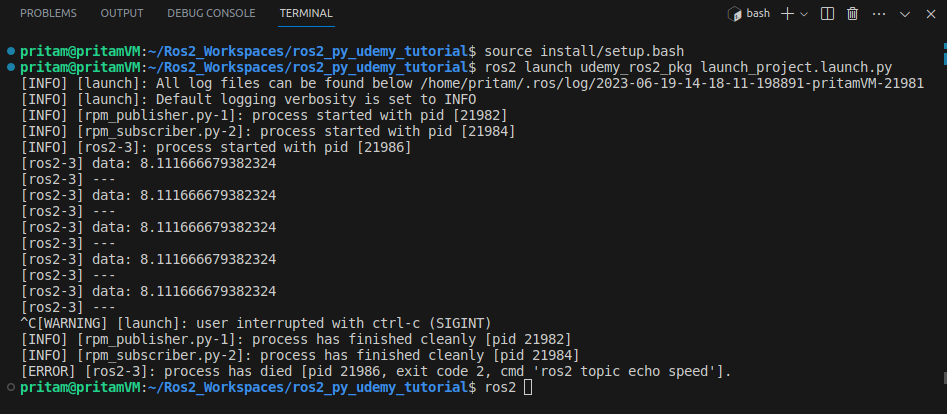

# Project 2.2. Launch Files (Python)

# Problem Statement

Create a file named **launch_project.launch.py** such that when we **launch** this file from the **terminal**:

1. It starts the **rpm_publisher.py** node.
2. It starts the **rpm_subscriber.py** node and also allows us to set the value of the **wheel_diameter** parameter.
3. It runs the `ros2 topic echo` command for **/speed** topic of the **rpm_subscriber.py** node.

# Solution

## **rpm_publisher.py Code (No Changes):**

```python
#! /usr/bin/env python3

import rclpy                        
from rclpy.node import Node         
from std_msgs.msg import Float32     
                                    
RPM = 10

class RpmPublisher(Node):    
    
    
    def __init__(self):
        super().__init__("rpm_pub_node")                                                                              
        self.pub = self.create_publisher(Float32, 'rpm', 10)            
        self.counter = 0                            
        self.timer = self.create_timer(0.5, self.rpm_publisher_callback_func)   
       
    def rpm_publisher_callback_func(self):
        msg = Float32()                                  
        msg.data = float(RPM) 
        self.pub.publish(msg)                          
        self.counter += 1 
                                     
def main(args=None):
    rclpy.init()                           
    my_pub =  RpmPublisher()         
    print("RPM Publisher Node is running...")
    
    try:
        rclpy.spin(my_pub)                  
                                            
    except KeyboardInterrupt:               
        print("Terminating publisher...")
        my_pub.destroy_node()               

if __name__=='__main__':  
    main()
```

## **rpm_subscriber.py Code (No changes):**

```python
#! /usr/bin/env python3

import rclpy
from std_msgs.msg import Float32
from rclpy.node import Node

DEFAULT_DIAMETER = 10.0   # meters

class RPMSubscriber(Node):
    def __init__(self):
        super().__init__("rpm_sub_node")  
        self.declare_parameter('wheel_diameter', DEFAULT_DIAMETER)      # Creating a parameter object named 'wheel_radius' 
                                                                        # and setting its default value equal to 
                                                                        # DEFAULT_DIAMETER variable.
        self.sub = self.create_subscription(Float32, 'rpm', self.subscriber_callback_func, 10)
        self.pub = self.create_publisher(Float32, 'speed', 10) 
        
        # print(self.get_parameter('wheel_diameter').get_parameter_value())     # printing the value of the 
                                                                                # 'wheel_diameter'  parameter object
        # Output:
        #*********
        # rcl_interfaces.msg.ParameterValue(type=3, bool_value=False, integer_value=0, double_value=10.0, string_value='', byte_array_value=[], bool_array_value=[], integer_array_value=[], double_array_value=[], string_array_value=[])
        
    def subscriber_callback_func(self, msg):
        wheel_diameter_param = self.get_parameter('wheel_diameter').get_parameter_value().double_value 
        # storing the 'double_value' attribute of the 'wheel_diameter' parameter object, inside the 'wheel_diameter_param' variable.
        # 'double_value' is the attribute of the 'wheel_diameter' parameter object which stores the default 'double' type value of DEFAULT_DIAMETER (= 10.0) variable.
        SPEED = (msg.data * 3.14 * wheel_diameter_param)/60   # SPEED = DISTANCE/TIME
                                                # DISTANCE = WHEEL CIRCUMFERENCE * RPM
                                                # TIME = 60 secs (1 minute)
        msg = Float32()
        msg.data = float(SPEED)
        self.pub.publish(msg)                                 
        
        
def main(args=None):
    rclpy.init()                            
    rpm_sub_node =  RPMSubscriber()       
    print("Waiting for rpm data to be published...")
    
    try:
        rclpy.spin(rpm_sub_node)                  
                                            
    except KeyboardInterrupt:              
        print("Terminating subscriber...")
        rpm_sub_node.destroy_node()               
        
if __name__ == '__main__':
    main()
```

## **launch_project.launch.py Code:**

```python
from launch import LaunchDescription
from launch_ros.actions import Node                                            
from launch.actions import ExecuteProcess

def generate_launch_description():
    
    return LaunchDescription([
        Node(
            package="udemy_ros2_pkg",                       
            executable="rpm_publisher.py",                  
            name="rpm_pub_node",                           
            
        ),
        Node(
            package="udemy_ros2_pkg",
            executable="rpm_subscriber.py",
            name="rpm_sub_node",
            # parameters=[ {"param_name":param_value} ]
            parameters=[{"wheel_diameter":15.5}]
        ),
        
        ExecuteProcess(
            cmd=["ros2", "topic", "echo", "speed"],  
            output="screen" 
        )                
    ])
```

## CMakeLists.txt Code **(No Changes)**:

```cmake
cmake_minimum_required(VERSION 3.8)
project(udemy_ros2_pkg)

if(CMAKE_COMPILER_IS_GNUCXX OR CMAKE_CXX_COMPILER_ID MATCHES "Clang")
  add_compile_options(-Wall -Wextra -Wpedantic)
endif()

# find dependencies
find_package(ament_cmake REQUIRED)
# Adding the below 2 dependencies for configuring our python 
# scripts stored inside /scripts folder into this package.
find_package(ament_cmake_python REQUIRED) 
find_package(rclpy REQUIRED)

ament_python_install_package(scripts)
# The above line of code is used to specify that our package contains Python scripts
# inside a "Python Package Folder" named "scripts". 
# It is a command provided by the ROS2 build system (ament) to configure 
# the installation of Python packages.
# A package folder is simply a python files folder containing a __init__.py file inside it.
# Make sure that the "scripts" folder has atleast a blank file named __init__.py inside it. 

# Specifying our python scripts.
install(PROGRAMS
  scripts/publisher.py
  scripts/subscriber.py
  scripts/rpm_publisher.py
  scripts/rpm_subscriber.py
  DESTINATION lib/${PROJECT_NAME}
)

install(DIRECTORY
        launch
        DESTINATION share/${PROJECT_NAME}/
)

if(BUILD_TESTING)
  find_package(ament_lint_auto REQUIRED)
  # the following line skips the linter which checks for copyrights
  # comment the line when a copyright and license is added to all source files
  set(ament_cmake_copyright_FOUND TRUE)
  # the following line skips cpplint (only works in a git repo)
  # comment the line when this package is in a git repo and when
  # a copyright and license is added to all source files
  set(ament_cmake_cpplint_FOUND TRUE)
  ament_lint_auto_find_test_dependencies()
endif()

ament_package()
```

## Output

