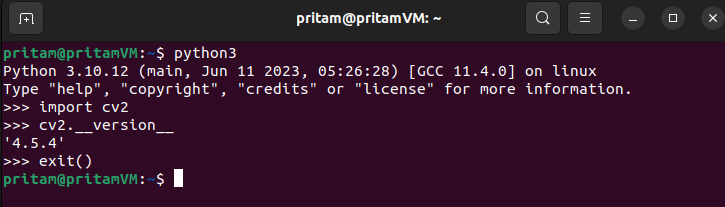

# Project 3.1. Using OpenCV With ROS2 Services (C++)

## Problem Statement

1. Create a **custom service interface** named **TurnCameraService.srv** which consists of a **request** message named “**angle**” of type “**float32**” and a **response** message named **“image”** of type “**sensor_msgs/Image**”.
2. Create a **Service Client** node named **angle_client.cpp** which uses the **TurnCameraService.srv** custom service interface to **send** the **request** message **“angle”** to a Service Client node via a service named **/turn_camera_service -** to turn the robot camera to a specified angle.
3. Create a **Service Server** node named **image_server.cpp** which uses the **TurnCameraService.srv** custom service interface to **receive** the **request** message **“angle”** from the Service Client and then processes this information to send back an **image response message** of **.png** format - that the robot takes after turning the camera by the instructed **angle** value.
4. The **Service Client** node should display the image received from the **Service Server.** 
5. Now, since we do not have a real robot and haven’t learned about making simulations yet, we are just going to have some pre-taken images - which are named by an angle - and store them inside the **ros2_cpp_udemy_tutorial/src/udemy_ros2_pkg/images** folder - from where we can use them in our code and return one of these images based on the **request** message **angle.**

## Additional Software Requirements

1. **OpenCV** library which is a free open-source computer vision library.
2. **CVBridge** package which is a **ROS2** **package** that helps us to convert **images** from **ROS Image Message** type to **OpenCV Image** type and vice-versa.

## Step1. Installing OpenCV and CVBridge

```bash
sudo apt update
sudo apt upgrade
sudo apt install python3-opencv libopencv-dev  # Installing OpenCV
sudo apt install ros-$ROS_DISTRO-cv-bridge # Installing CV Bridge
```

- To check if **OpenCV** is installed properly in your Ubuntu System, run the following commands from the same terminal.
    
    ```bash
    python3
    import cv2
    cv2.__version__   # On pressing ENTER you should see the opencv version
    
    exit()
    ```
    
    
    
- Another way to check **OpenCV** Version is to run the following command from the terminal:
    
    ```bash
    dpkg -s libopencv-dev
    ```
    
    
    

## Step 2. Include Dependencies in `package.xml`

```xml
<depend>sensor_msgs</depend>
<depend>OpenCV</depend>
<depend>cv_bridge</depend>
```

## Step 3. Include Dependencies in `CMakeLists.txt`

```cmake
find_package(sensor_msgs REQUIRED)  
find_package(OpenCV REQUIRED)  
find_package(cv_bridge REQUIRED)
```

## Step 4. Write the code for **`TurnCameraService.srv`** Custom Service Interface

```bash
float32 angle  # Request Message
---
sensor_msgs/Image image  # Response Message

# If we are using any other message interface - other than the "std_msgs/msg/" primitive datatype interfaces (ex - int64, float32, float64, bool, string etc.) - to define our request or response message - then we must mention the complete interface name - as it appears on the 'ros2 interface list' - ommitting the /msg/ part in between - while mentioning the datatype of the message. 

# Example - "sensor_msgs/Image" image 

# Here, while mentioning the type of response message "image", we do not use /msg/ explicitly because ROS knows that we cannot use any other interface - other than the "Message" type interfaces as datatypes for request and response messages, while defining a custom service interface.
```

## Step 5. Include **`TurnCameraService.srv`** Custom Service Interface in `CMakeLists.txt` file

```python
# Modify the existing CMakeLists.txt code here
rosidl_generate_interfaces(${PROJECT_NAME} 
                          "srv/OddEvenCheck.srv" 
                          ***"srv/TurnCameraService.srv" 
                          DEPENDENCIES
                          sensor_msgs*** 
                          ADD_LINTER_TESTS )
```

> **💡 #Note:** When we use any other message interface - other than the "std_msgs/msg/" primitive datatype interfaces (ex - int64, float32, float64, bool, string, etc.) - to define our request or response message in a custom service interface (ex- TurnCameraService.srv) - then we must MENTION the name of the message package (sensor_msgs) that we are using in the interface - under the DEPENDENCIES section in the above line of code.
> 

## Step 6. Write the code for `angle_client.cpp`

```cpp
#include "rclcpp/rclcpp.hpp"  // This line includes the header file for the ROS Client Library For C++ (rclcpp) API , which provides the basic functionality required to create ROS2 nodes in C++.
#include "udemy_ros2_pkg/srv/turn_camera_service.hpp"  // This line includes the header file for the 'TurnCameraService.srv' custom service interface i.e defined in the udemy_ros2_pkg/srv folder. It is necessary for using the service interface in the C++ code. This service is used to turn the camera to a specified angle and return an image taken from that angle.
#include "opencv2/imgcodecs.hpp"  // This line includes the header file for the 'OpenCV Image Codecs' module of OpenCV Library. The Image Codecs module in OpenCV could be described as a collection of functions and classes within the OpenCV library that provides support for reading, writing, and compressing images in a variety of file formats.
#include "cv_bridge/cv_bridge.h"
// This line includes the header file cv_bridge.h from the cv_bridge package.
// The cv_bridge package is part of ROS2 and provides an interface between ROS2 and the OpenCV image processing library. The cv_bridge package provides a set of classes and functions that allow users to convert between ROS image messages and OpenCV images. 
// The 'cv_bridge.h' header file provides the declaration for the main 'cv_bridge' class, 'CvBridge', which is used to perform the conversions between ROS image messages and OpenCV images. By including this header file, the code has access to the 'CvBridge' class and can use it to perform these conversions.
#include "opencv2/highgui.hpp"  // Including header file for GUI tool to display recieved images.

#include <iostream>   // This line includes the 'iostream' library of the C++ 'std' namespace which provides the necessary functions for input and output operations.

int main(int argc, char* argv[]){
    rclcpp::init(argc, argv);

    auto node = rclcpp::Node::make_shared("angle_client_node");  // Creating a Simple Node Object
    auto client = node->create_client<udemy_ros2_pkg::srv::TurnCameraService>("turn_camera_service");  
    // Creating a client object of 'rclcpp::Service<udemy_ros2_pkg::srv::TurnCameraService>::SharedPtr' class from the node object.
    auto request = std::make_shared<udemy_ros2_pkg::srv::TurnCameraService::Request>(); // Creating a Request object

    std::cout<<"Please enter the angle value : ";
    std::cin>>request->angle;

    client->wait_for_service();  // Wait till the service node become active

    auto result = client->async_send_request(request);  //Here, we have recieved a ROS Image Interface (sensor_msgs/msg/Image) Future Object as a response message - for our 'float32 angle' request message - from the server client node - which will get stored inside the 'auto result' variable. 

    if(rclcpp::spin_until_future_complete(node, result) == rclcpp::FutureReturnCode::SUCCESS)
    // rclcpp::spin_until_future_complete(node, result) function keeps the 'node' running until the future object inside 'result' is completed. Finally, this function returns a rclcpp::FutureReturnCode which can be SUCCESS, INTERRUPTED OR TIMEOUT.
    {
        //Converting the image from ROS Image Interface Object Format to OpenCV Image Format through cv_bridge.
        auto cv_ptr = cv_bridge::toCvCopy(result.get()->image, "bgr8");  
        // Stores an OpenCV Image Object Shared Pointer
        // auto cv_ptr = cv_bridge::toCvCopy(result.get()->response_attr_name, image_encoding);
        auto cv_image = cv_ptr->image;

        //Display Image in OpenCV Window
        cv::imshow("Robot Camera Image", cv_image);
        // cv::imshow("Title_of _Image", cv_image_name);
        cv::waitKey(0);
        // cv::waitKey(0); --> Keep the window open until we hit enter
        // cv::waitkey(1000) --> Keep the window open for the given amount of milliseconds.
    }
    else {
        std::cout<<"Sorry! Image could not be displayed due to some technical problem..."<<std::endl;
    }   

    rclcpp::shutdown(); // Shutting down the ROS2 System and freeing the resources.

    return 0;
}
```

## Step 7. Add the `angle_client` executable to CMakeLists.txt

```cmake
add_executable(angle_client src/angle_client.cpp)
ament_target_dependencies(angle_client rclcpp sensor_msgs OpenCV cv_bridge)
target_link_libraries(angle_client "${cpp_typesupport_target}")

install(TARGETS 
        publisher 
        subscriber
        rpm_publisher
        rpm_subscriber
        service_client
        service_server
        angle_client
        DESTINATION lib/${PROJECT_NAME}
)
```

## Step 8. Write the code for `image_server.cpp`

```cpp
// The code is designed to receive a float 'angle' value from a service client node and return an image corresponding to that 'angle' value.

#include "rclcpp/rclcpp.hpp"  // This line includes the header file for the ROS Client Library For C++ (rclcpp) API , which provides the basic functionality required to create ROS2 nodes in C++.
#include "udemy_ros2_pkg/srv/turn_camera_service.hpp" // This line includes the header file for the 'TurnCameraService.srv' custom service interface i.e defined in the udemy_ros2_pkg/srv folder. It is necessary for using the service interface in the C++ code. This service is used to turn the camera to a specified angle and return an image taken from that angle.
#include "opencv2/imgcodecs.hpp"  // This line includes the header file for the 'OpenCV Image Codecs' module of OpenCV Library. The Image Codecs module in OpenCV could be described as a collection of functions and classes within the OpenCV library that provides support for reading, writing, and compressing images in a variety of file formats.
#include "cv_bridge/cv_bridge.h" 
// This line includes the header file cv_bridge.h from the cv_bridge package.
// The cv_bridge package is part of ROS2 and provides an interface between ROS2 and the OpenCV image processing library. The cv_bridge package provides a set of classes and functions that allow users to convert between ROS image messages and OpenCV images. 
// The 'cv_bridge.h' header file provides the declaration for the main 'cv_bridge' class, 'CvBridge', which is used to perform the conversions between ROS image messages and OpenCV images. By including this header file, the code has access to the 'CvBridge' class and can use it to perform these conversions.

#include <iostream>  // This line includes the 'iostream' library of the C++ 'std' namespace which provides the necessary functions for input and output operations.

class ImageServerNodeClass : public rclcpp::Node   
{
private:
    std::string ws_dir_;  // Method-2  // Step-1
    
    // Service class object :: SharedPtr
    rclcpp::Service<udemy_ros2_pkg::srv::TurnCameraService>::SharedPtr service_server_;

    // Calback function
    void check_angle_send_pic(const udemy_ros2_pkg::srv::TurnCameraService::Request::SharedPtr request, udemy_ros2_pkg::srv::TurnCameraService::Response::SharedPtr response)
    {
        //<------------------------------------ Common Part ------------------------------------------>//

        // Extracting angle from the request object
        float angle = request->angle;

        //<------------------------------------ Method-1 ------------------------------------------>//

        // // Creating a variable for storing the OpenCV image object - read from the image address.
        // auto image = cv::imread("/src/udemy_ros2_pkg/images/-30.png");

        // // Selecting the Image Path
        // if (angle == -30)
        // {
        //     // Reading Image from the File
        //     image = cv::imread("/src/udemy_ros2_pkg/images/-30.png");
        // }
        // else if (angle == -15)
        // {
        //     // Reading Image from the File
        //     image = cv::imread("src/udemy_ros2_pkg/images/-15.png");
        // }
        // else if (angle == 0)
        // {
        //     // Reading Image from the File
        //     image = cv::imread("src/udemy_ros2_pkg/images/0.png");
        // }
        // else if (angle == 15)
        // {
        //     // Reading Image from the File
        //     image = cv::imread("src/udemy_ros2_pkg/images/15.png");
        // }
        // else if (angle == 30)
        // {
        //     // Reading Image from the File
        //     image = cv::imread("src/udemy_ros2_pkg/images/30.png");
        // }

        //<------------------------------------ Method-2 ------------------------------------------>//

        // Creating image_path from the recieved 'angle'  // Step-5
        std::string image_path = ws_dir_ + "/src/udemy_ros2_pkg/images/" + std::to_string((int)angle) + ".png";

        // std::string image_path = "/home/pritam/Ros2_Workspaces/ros2_cpp_udemy_tutorial/src/udemy_ros2_pkg/images/" + std::to_string((int)angle) + ".png";

        std::cout<<image_path<<std::endl;

        // Creating an image variable for storing the OpenCV image object - read from the image address.
        auto image = cv::imread(image_path);

        //<------------------------------------ Common Part ------------------------------------------>//

        // Converting the OpenCV Image Object to ROS Image Interface Object (sensor_msgs/msg/Image) to share it to the angle_client_node.
        auto img_msg_ptr = cv_bridge::CvImage(std_msgs::msg::Header(), "bgr8", image).toImageMsg();
        auto image_msg = *img_msg_ptr;
        response->image = image_msg;
    };
    

    std::string get_ws_dir(std::string exe_dir) // Method-2  // Step-4
    // The purpose of this function is to extract the path of a workspace directory from the given executable directory path 'exe_dir'.  // This function takes a std::string parameter 'exe_dir' and returns a std::string value. 
    {
        // value of std::string exe_dir = /home/pritam/Ros2_Workspaces/ros2_cpp_udemy_tutorial/install/udemy_ros2_pkg/lib/udemy_ros2_pkg/image_server

        std::string::size_type substr_index = exe_dir.find("install");
        // This line uses the find method of the 'std::string' class to search for the substring "install" in the 'exe_dir' string. If the substring is found, the find method returns the 'index position value' of the starting point of the substring in the string.  The result of the find method is stored in a std::string::size_type variable named substr_index.
        return exe_dir.substr(0, substr_index);
        // This line uses the substr method of the std::string class to extract a substring from the exe_dir string. The substr method takes two arguments: the starting position of the substring and the length of the substring. In this case, the starting position is 0 (the beginning of the string), and the length is substr_index (the position of the substring "install"). The result of the substr method is returned as the result of the get_ws_dir function.
    }

public:
    // ImageServerNodeClass() : Node("image_server_node")  // Method-1

    ImageServerNodeClass(std::string exe_dir) : Node("image_server_node")  // Method-2  // Step-2  
    // The value of 'std::string exe_dir' - passed as an argument to the constructor ImageServerNodeClass() - is the address/location of the directory containing the executable "image_server", on your system. 
    {
        std::cout<<exe_dir<<std::endl;
        // /home/pritam/Ros2_Workspaces/ros2_cpp_udemy_tutorial/install/udemy_ros2_pkg/lib/udemy_ros2_pkg/image_server

        ws_dir_ = get_ws_dir(exe_dir);  // Method-2  // Step-3  
        // The get_ws_dir() method is called from the constructor to extract the workspace directory address from the 'exe_dir' argument which is the address of the executable "image_server". The extracted workspace directory is then stored in the ws_dir_ member variable for later use.

        std::cout<<ws_dir_<<std::endl;
        // /home/pritam/Ros2_Workspaces/ros2_cpp_udemy_tutorial/

        service_server_ = this->create_service<udemy_ros2_pkg::srv::TurnCameraService>(
            "turn_camera_service",
            std::bind(&ImageServerNodeClass::check_angle_send_pic, this, std::placeholders::_1, std::placeholders::_2));
        // The callback function 'ImageServerNodeClass::check_angle_send_pic' takes 2 arguments - std::placeholders::_1 & std::placeholders::_2.
        // std::placeholders::_1 represents the constant argument - udemy_ros2_pkg::srv::TurnCameraService::Request::SharedPtr object - which contains the 'float32 angle' Request Message - that will be sent by the angle_client_node to image_server_node.
        // std::placeholders::_2 represents the future object of udemy_ros2_pkg::srv::TurnCameraService::Response::SharedPtr class - which contains the response message 'sensor_msgs/Image image' - and will be sent back to the angle_client_node once the function operation is complete.

        std::cout << "Image Server Node Is Running..." << std::endl;
    }
};

// Driver Code:
int main(int argc, char* argv[])

// The main function is the entry point of the program.

// argc and argv are the standard arguments for a C++ main function.

// "char* argv[]" is the second argument passed to the "main" function in C++. It's an array of "character" pointers (char*) - pointers pointing to a 'char' type value - where each element of the array is actually pointing to a "null-terminated character array".

// A null-terminated character array, also known as a null-terminated string, is a sequence of characters in C or C++ that is terminated by a special character called a 'null character' that is represented by the value '\0' and it signals the end of the string. 

// Here is an example of a "null-terminated character array" in C++: 

//      char hello[] = "Hello, World!\0";   <----- Example of null-terminated character array

// The null character '\0' is automatically added to the end of the string to signal the end of the string.

// The "char* argv[]" is an array of 'character' pointers pointing to exactly these kind of "null-terminated character arrays" as shown above.

// The "argc" argument represents the number of elements in the "argv" array. The "argc" argument gives the number of command line arguments passed to the program, and "argv" holds the actual arguments as strings -  including the name of the executable.

// For example, if you run your program with the command:

// ./your_program arg1 arg2 arg3

// Then, "argc" would be 4 and "argv" would contain the following values:

// argv[0] = "./your_program"
// argv[1] = "arg1"
// argv[2] = "arg2"
// argv[3] = "arg3"

// Now, in our case the the bash command used for running this c++ ros2 code in the terminal is : ros2 run udemy_ros2_pkg image_server 
// So, the value of 'int argc' = 2.
// And, value of 'char argv[]' = ["image_server", "udemy_ros2_pkg"]
// *argv[0] = "image_server\0" = name of the executable
// *argv[1] = "udemy_ros2_pkg\0" = name of the package

{
    rclcpp::init(argc, argv);  // The function rclcpp::init(argc, argv) initializes the ROS 2 system/environment with the given command-line arguments. // argc and argv are the standard arguments for a C++ main() function.

    // rclcpp::spin(std::make_shared<ImageServerNodeClass>());  // Method-1
    // The argument 'std::make_shared<ImageServerNodeClass>()' creates a shared pointer of an ImageServerNodeClass object and the 'rclcpp::spin()' function keeps running the argument code repeatedly - until the opertation is terminated deliberately from the terminal. 

    rclcpp::spin(std::make_shared<ImageServerNodeClass>(argv[0]));  // Method-2  // Step-0
    // argv[0] is the first element of the "char* argv[]" array - passed as an argument to the 'int main()' function - a character pointer, pointing to the "image_server" null-terminated character array i.e the name of the executable of this code.
    // *argv[0] = "image_server\0" = name of the executable
    // In this line of code, argv[0] is passed as an argument to the constructor of the 'ImageServerNodeClass' to be used to extract the workspace directory.

    rclcpp::shutdown();  // The function rclcpp::shutdown() shuts down the ROS 2 system and frees any associated resources.

    return 0;  // The function returns 0, which indicates that the program has terminated successfully.
}
```

## Step 9. Add the `image_server` executable to CMakeLists.txt

```cmake
add_executable(image_server src/image_server.cpp)
ament_target_dependencies(image_server rclcpp sensor_msgs OpenCV cv_bridge)
target_link_libraries(image_server "${cpp_typesupport_target}")

install(TARGETS 
        publisher 
        subscriber
        rpm_publisher
        rpm_subscriber
        service_client
        service_server
        angle_client
        image_server
        DESTINATION lib/${PROJECT_NAME}
)
```

## Step 10. Finally, **save all the files and build the workspace.**


## Bash Command To Run `image_server` Executable (Terminal A) :

```cpp
ros2 run udemy_ros2_pkg image_server
```

## Bash Command To Run `angle_client` Executable (Terminal B) :

```cpp
 ros2 run udemy_ros2_pkg angle_client
```

## Complete `CMakeLists.txt` File Code:

```cmake
cmake_minimum_required(VERSION 3.8)
project(udemy_ros2_pkg)

if(CMAKE_COMPILER_IS_GNUCXX OR CMAKE_CXX_COMPILER_ID MATCHES "Clang")
  add_compile_options(-Wall -Wextra -Wpedantic)
endif()

# find dependencies
find_package(ament_cmake REQUIRED)
find_package(rclcpp REQUIRED)
find_package(std_msgs REQUIRED)
# Necessary import for using Custom Service Interfaces
find_package(rosidl_default_generators REQUIRED)
find_package(sensor_msgs REQUIRED)  
find_package(OpenCV REQUIRED)  
find_package(cv_bridge REQUIRED)

if(BUILD_TESTING)
  find_package(ament_lint_auto REQUIRED)
  set(ament_cmake_copyright_FOUND TRUE)
  set(ament_cmake_cpplint_FOUND TRUE)
  ament_lint_auto_find_test_dependencies()
endif()

# We need to tell our ros2 compiler - the exact specifics of the newly created custom service interface files - that it needs to have the IDL Code generated for.
# This line of code should always come before the add_excutable blocks, if you are planning to use the generated custom interface in these executables.
rosidl_generate_interfaces(${PROJECT_NAME} 
                          "srv/OddEvenCheck.srv" 
                          "srv/TurnCameraService.srv" 
                          DEPENDENCIES
                          sensor_msgs 
                          ADD_LINTER_TESTS )                                                            
 
# Set support for using custom interfaces in C++ from this package
# This line should always be below the "rosidl_generate_interfaces()" code - otherwise it will produce compilation error.
rosidl_get_typesupport_target(cpp_typesupport_target "${PROJECT_NAME}" "rosidl_typesupport_cpp")

add_executable(publisher src/publisher.cpp) 
ament_target_dependencies(publisher rclcpp std_msgs)

add_executable(subscriber src/subscriber.cpp) 
ament_target_dependencies(subscriber rclcpp std_msgs)

add_executable(rpm_publisher src/rpm_publisher.cpp)
ament_target_dependencies(rpm_publisher rclcpp std_msgs)

add_executable(rpm_subscriber src/rpm_subscriber.cpp)
ament_target_dependencies(rpm_subscriber rclcpp std_msgs)

add_executable(service_client src/service_client.cpp)
ament_target_dependencies(service_client rclcpp std_msgs)
target_link_libraries(service_client "${cpp_typesupport_target}")

add_executable(service_server src/service_server.cpp)
ament_target_dependencies(service_server rclcpp std_msgs)
target_link_libraries(service_server "${cpp_typesupport_target}")

add_executable(angle_client src/angle_client.cpp)
ament_target_dependencies(angle_client rclcpp sensor_msgs OpenCV cv_bridge)
target_link_libraries(angle_client "${cpp_typesupport_target}")

add_executable(image_server src/image_server.cpp)
ament_target_dependencies(image_server rclcpp sensor_msgs OpenCV cv_bridge)
target_link_libraries(image_server "${cpp_typesupport_target}")

install(TARGETS 
        publisher 
        subscriber
        rpm_publisher
        rpm_subscriber
        service_client
        service_server
        angle_client
        image_server
        DESTINATION lib/${PROJECT_NAME}
)

install(
  DIRECTORY
  launch
  DESTINATION share/${PROJECT_NAME}
)

ament_package()
```

## Complete `package.xml` File Code:

```xml
<?xml version="1.0"?>
<?xml-model href="http://download.ros.org/schema/package_format3.xsd" schematypens="http://www.w3.org/2001/XMLSchema"?>
<package format="3">
  <name>udemy_ros2_pkg</name>
  <version>0.0.0</version>
  <description>TODO: Package description</description>
  <maintainer email="pritam@todo.todo">pritam</maintainer>
  <license>TODO: License declaration</license>

  <buildtool_depend>ament_cmake</buildtool_depend>

  <depend>rclcpp</depend>
  <depend>std_msgs</depend>
  <depend>sensor_msgs</depend>
  <depend>OpenCV</depend>
  <depend>cv_bridge</depend>
  <build_depend>rosidl_default_generators</build_depend>
  <!-- Indicates that the package requires the rosidl_default_generators package during the build process. rosidl_default_generators contains the default code generators for the ROS 2 Interface Definition Language (IDL). -->
  <exec_depend>rosidl_default_runtime</exec_depend>
  <!-- Indicates that the package requires the rosidl_default_runtime package during execution so that the Interface Definition Language (IDL) created can be used during node runtime. -->
  <member_of_group>rosidl_interface_packages</member_of_group>
  <!-- Indicates that the package is a member of the rosidl_interface_packages group.  -->

  <test_depend>ament_lint_auto</test_depend>
  <test_depend>ament_lint_common</test_depend>

  <export>
    <build_type>ament_cmake</build_type>
  </export>

</package>
```