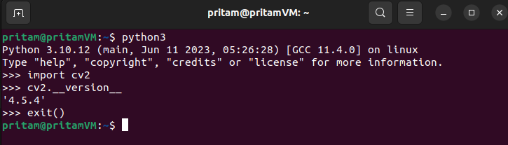

# Project 3.2. Using OpenCV With ROS2 Services (Python)

## Problem Statement

1. Create a **custom service interface** named **TurnCameraService.srv** which consists of a **request** message named “**angle**” of type “**float32**” and a **response** message named **“image”** of type “**sensor_msgs/Image**”.
2. Create a **Service Client** node named **turn_camera_client.py** which uses the **TurnCameraService.srv** custom service interface to **send** the **request** message **“angle”** to a Service Client node via a service named **/turn_camera -** to turn the robot camera to a specified angle.
3. Create a **Service Server** node named **turn_camera_server.py** which uses the **TurnCameraService.srv** custom service interface to **receive** the **request** message **“angle”** from the Service Client and then processes this information to send back an **image response message** of **.png** format - that the robot takes after turning the camera by the instructed **angle** value.
4. The **Service Client** node should display the image received from the **Service Server.** 
5. Now, since we do not have a real robot and haven’t learned about making simulations yet, we are just going to have some pre-taken images - which are named by an angle - and store them inside the **ros2_py_udemy_tutorial/src/udemy_ros2_pkg/images** folder - from where we can use them in our code and return one of these images based on the **request** message **angle.**
6. You can click some images on your own. Name them one by one as -30, -15, 0, 15 & 30 respectively. Store these images inside the **ros2_py_udemy_tutorial/src/udemy_ros2_pkg/images** folder.

## Additional Software Requirements

1. **OpenCV** library which is a free open-source computer vision library.
2. **CVBridge** package which is a **ROS2** **package** that helps us to convert **images** from **ROS Image Message** type to **OpenCV Image** type and vice-versa.

## Installing OpenCV and CVBridge

```bash
sudo apt update
sudo apt upgrade
sudo apt install python3-opencv libopencv-dev  # Installing OpenCV
sudo apt install ros-$ROS_DISTRO-cv-bridge # Installing CV Bridge
```

- To check if **OpenCV** is installed properly in your Ubuntu System, run the following commands from the same terminal.
    
    ```bash
    python3
    import cv2
    cv2.__version__   # On pressing ENTER you should see the opencv version
    
    exit()
    ```
    
    
    
- Another way to check **OpenCV** Version is to run the following command from the terminal:
    
    ```bash
    dpkg -s libopencv-dev
    ```
    
    
    

## Include Dependencies in `package.xml`

```xml
<depend>OpenCV</depend>
<depend>cv_bridge</depend>
```

## Include Dependencies in `CMakeLists.txt`

```python
find_package(OpenCV REQUIRED)  
find_package(cv_bridge REQUIRED)
```

## Write the code for **`TurnCameraService.srv`** Custom Service Interface

```bash
float32 angle  # Request Message
---
sensor_msgs/Image image  # Response Message

# If we are using any other message interface - other than the "std_msgs/msg/" primitive datatype interfaces (ex - int64, float32, float64, bool, string etc.) - to define our request or response message - then we must mention the complete interface name - as it appears on the 'ros2 interface list' - ommitting the /msg/ part in between - while mentioning the datatype of the message. 

# Example - "sensor_msgs/Image" image 

# Here, while mentioning the type of response message "image", we do not use /msg/ explicitly because ROS knows that we cannot use any other interface - other than the "Message" type interfaces as datatypes for request and response messages, while defining a custom service interface.
```

## Include **`TurnCameraService.srv`** Custom Service Interface in `CMakeLists.txt` file

```python
# Adding the below dependency since we are using sensor_msgs library in 
# the TurnCameraService.srv interface and some of our python codes in this package.
find_package(sensor_msgs REQUIRED)

# Telling our compiler exactly what new custom interfaces files we have created in our package
# that needs to have the ros idl code generated for it.
rosidl_generate_interfaces(${PROJECT_NAME}
  "srv/OddEvenCheck.srv"
  "srv/TurnCameraService.srv"
  DEPENDENCIES 
  sensor_msgs
)
# ${PROJECT_NAME} signifies the name of our package (udemy_ros2_pkg)

# sensor_msgs/msg/Image is the type of message interface that we are using inside the 
# TurnCameraService.srv as response message datatype. Since this message interface does 
# not belong to the group of standard message intefaces (std_msgs/msg/**), 
# therefore, we need to include this complete package of sensor_msgs as a dependency in the above code of rosidl_generate_interfaces.
```

## Importing OpenCV and CvBridge Into the Python Code:

```python
import cv2
from cv_bridge import CvBridge
```

## Converting ROS Image Message into OpenCV Image Format

```python
opencv_image = CvBridge().imgmsg_to_cv2(ros_image) 
```

## Display Image In OpenCV Window

```python
cv2.imshow("Display Window Name", image)
cv2.waitKey(0)  # Notice that the K of waitKey is capital.
								# Zero (0) signifies that image display window should stay 
								# open until we close it by pressing the ENTER key.
cv2.destroyAllWindows()  # Closing all opencv windows.
```

## Reading An Image From File

```python
opencv_image = cv2.imread(complete_file_location)
```

## Converting OpenCV Image To ROS Image Message

```python
opencv_image = cv2.imread(complete_file_location)
ros_image = CvBridge().cv2_to_imgmsg(opencv_image)
```

## Completed Project Code:

### 1. `package.xml`

```xml
<?xml version="1.0"?>
<?xml-model href="http://download.ros.org/schema/package_format3.xsd" schematypens="http://www.w3.org/2001/XMLSchema"?>
<package format="3">
  <name>udemy_ros2_pkg</name>
  <version>0.0.0</version>
  <description>TODO: Package description</description>
  <maintainer email="pritam@todo.todo">pritam</maintainer>
  <license>TODO: License declaration</license>

  <buildtool_depend>ament_cmake</buildtool_depend>

  <!-- Adding the below 2 dependencies - to configure .py scripts into the package. -->
  <!-- Adding while configuring 'publisher.py' and 'subscriber.py' files into the 'udemy_ros_pkg' package -->
  <buildtool_depend>ament_cmake_python</buildtool_depend>
  <depend>rclpy</depend>
  <!-- Adding the below dependency to use OpenCV in our udemy_ros2_pkg Package codes -->
  <depend>OpenCV</depend>
  <!-- Adding the below dependency to use CvBridge in our udemy_ros2_pkg Package codes -->
  <depend>cv_bridge</depend>

  <!-- Adding the below dependencies in order to be able to use our Custom ROS Service Inteface OddEvenCheck.srv -->
  <build_depend>rosidl_default_generators</build_depend>
  <!-- The above build_dependency is used to generate the idl(interactive data language) code for our Custom ROS Service Intefaces -->
  <exec_depend>rosidl_default_runtime</exec_depend>
  <!-- Above dependency is added so that the the idl(interactive data language) code can be used at node runtime. -->
  <member_of_group>rosidl_interface_packages</member_of_group>
  <!-- Above dependency is added to include our Custom Service Intefaces into the ROS2 Interfaces List.  -->

  <test_depend>ament_lint_auto</test_depend>
  <test_depend>ament_lint_common</test_depend>

  <export>
    <build_type>ament_cmake</build_type>
  </export>
</package>
```

### 2. `CMakeLists.txt`

```python
cmake_minimum_required(VERSION 3.8)
project(udemy_ros2_pkg)

if(CMAKE_COMPILER_IS_GNUCXX OR CMAKE_CXX_COMPILER_ID MATCHES "Clang")
  add_compile_options(-Wall -Wextra -Wpedantic)
endif()

# find dependencies
find_package(ament_cmake REQUIRED)
# Adding the below 2 dependencies for configuring our python 
# scripts stored inside /scripts folder into this package.
find_package(ament_cmake_python REQUIRED) 
find_package(rclpy REQUIRED)
# Adding the below dependency for configuring all the 
# Custom ROS Service Interfaces created inside this package.
find_package(rosidl_default_generators REQUIRED)
# Adding the below dependency to use OpenCV in our udemy_ros2_pkg Package codes
find_package(OpenCV REQUIRED)
# Adding the below dependency to use CvBridge in our udemy_ros2_pkg Package codes
find_package(cv_bridge REQUIRED)
# Adding the below dependency since we are using sensor_msgs library in 
# the TurnCameraService.srv interface and some of our python codes in this package.
find_package(sensor_msgs REQUIRED) 

ament_python_install_package(scripts)
# The above line of code is used to specify that our package contains Python scripts
# inside a "Python Package Folder" named "scripts". 
# It is a command provided by the ROS2 build system (ament) to configure 
# the installation of Python packages.
# A package folder is simply a python files folder containing a __init__.py file inside it.
# Make sure that the "scripts" folder has atleast a blank file named __init__.py inside it. 

# Specifying our python scripts.
install(PROGRAMS
  scripts/publisher.py
  scripts/subscriber.py
  scripts/rpm_publisher.py
  scripts/rpm_subscriber.py
  scripts/service_server.py
  scripts/service_client.py
  scripts/turn_camera_client.py
  scripts/turn_camera_server.py
  DESTINATION lib/${PROJECT_NAME}
)

# Configuring the launch folder which contains launch files for this package.
install(DIRECTORY
        launch
        DESTINATION share/${PROJECT_NAME}/
)

# Telling our compiler exactly what new custom interfaces files we have created in our package
# that needs to have the ros idl code generated for it.
rosidl_generate_interfaces(${PROJECT_NAME}
  "srv/OddEvenCheck.srv"
  "srv/TurnCameraService.srv"
  DEPENDENCIES 
  sensor_msgs
)
# ${PROJECT_NAME} signifies the name of our package (udemy_ros2_pkg)

# sensor_msgs/msg/Image is the type of message interface that we are using inside the 
# TurnCameraService.srv as response message datatype. Since this message interface does 
# not belong to the group of standard message intefaces (std_msgs/msg/**), 
# therefore, we need to include this complete package of sensor_msgs as a dependency in the 
# above code of rosidl_generate_interfaces.

if(BUILD_TESTING)
  find_package(ament_lint_auto REQUIRED)
  # the following line skips the linter which checks for copyrights
  # comment the line when a copyright and license is added to all source files
  set(ament_cmake_copyright_FOUND TRUE)
  # the following line skips cpplint (only works in a git repo)
  # comment the line when this package is in a git repo and when
  # a copyright and license is added to all source files
  set(ament_cmake_cpplint_FOUND TRUE)
  ament_lint_auto_find_test_dependencies()
endif()

ament_package()
```

### 3. `TurnCameraService.srv`

```python
# Request Message
float32 angle
---
# Response Message
sensor_msgs/Image image
```

### 4. `turn_camera_server.py`

```python
#! /usr/bin/env python3

import rclpy
from rclpy.node import Node
import cv2                      # Importing OpenCv 
from cv_bridge import CvBridge  # Importing CvBridge

from udemy_ros2_pkg.srv import TurnCameraService

class TurnCameraServer(Node):
    def __init__(self):
        super().__init__("turn_camera_server_node")
        self.server = self.create_service(TurnCameraService, 'turn_camera', self.return_image)
    
    def return_image(self, request, response):
        print("Request from turn_camera_client is recieved...")    
        print(request.angle)  # printing the angle value recived as request message
        
        # Reading image from the image "image" folder based on recived angle value.
        if request.angle == -30.0:
            opencv_image = cv2.imread("/home/pritam/Ros2_Workspaces/ros2_py_udemy_tutorial/src/udemy_ros2_pkg/images/-30.png")
        elif request.angle == -15.0:
            opencv_image = cv2.imread("/home/pritam/Ros2_Workspaces/ros2_py_udemy_tutorial/src/udemy_ros2_pkg/images/-15.png")
        elif request.angle == 0.0:
            opencv_image = cv2.imread("/home/pritam/Ros2_Workspaces/ros2_py_udemy_tutorial/src/udemy_ros2_pkg/images/0.png")
        elif request.angle == 15.0:
            opencv_image = cv2.imread("/home/pritam/Ros2_Workspaces/ros2_py_udemy_tutorial/src/udemy_ros2_pkg/images/15.png")
        elif request.angle == 30.0:
            opencv_image = cv2.imread("/home/pritam/Ros2_Workspaces/ros2_py_udemy_tutorial/src/udemy_ros2_pkg/images/30.png")
        
        # Converting the read Image from OpenCv Format into ROS Image Format.
        ros_image = CvBridge().cv2_to_imgmsg(opencv_image)
        
        response.image = ros_image
        
        return response
        
        
def main(args=None):
    rclpy.init()                           
    print("Turn Camera Server is running...")
    server_node =  TurnCameraServer()         
    
    try:
        rclpy.spin(server_node)                  
                                            
    except KeyboardInterrupt:               
        print("Terminating Turn Camera Server Node...")
        server_node.destroy_node()               

if __name__=='__main__':  
    main()
```

### 5. `turn_camera_client.py`

```python
#! /usr/bin/env python3

import rclpy
from rclpy.node import Node
import cv2                      # Importing OpenCv 
from cv_bridge import CvBridge  # Importing CvBridge

from udemy_ros2_pkg.srv import TurnCameraService

class TurnCameraClient(Node):
    def __init__(self):
        super().__init__("turn_camera_client_node")
        self.client = self.create_client(TurnCameraService, 'turn_camera')
        self.req = TurnCameraService.Request()
        
    def send_request(self, num):
        self.req.angle = float(num)
        print("waiting for turn_camera server to become active...")
        self.client.wait_for_service()
        self.future = self.client.call_async(self.req)
        rclpy.spin_until_future_complete(self, self.future)
        
        self.result = self.future.result()  # Here we recieve the ROS Image Message from 
                                            # turn_camera service server. 
        return self.result
        

def main(args=None):
    rclpy.init()
    client_node = TurnCameraClient()
    print("Turn Camera Client Node is running...")
    
    try:
        angle_input = input("Enter an angle from -15, -30, 0, 15 or 30 degrees: ")
        response = client_node.send_request(angle_input)
        ros_image = response.image
        
        # Converting the ROS Image Message recived into OpenCv Image Format
        # so that we can display the recieved image in the OpenCv Window.
        opencv_image = CvBridge().imgmsg_to_cv2(ros_image)
        # Displaying Image in OpenCv Window
        cv2.imshow("Recieved Image", opencv_image)
        cv2.waitKey(0)  # zero (0) signifies that the window should stay open until 
                        # we close it with ENTER key on keyboard. 
        cv2.destroyAllWindows()     # allows users to destroy or close all opencv windows 
                                    # opencv windows at any time
          
    except KeyboardInterrupt:
        print("Aborting Turn Camera Client Node")
        client_node.destroy_node()

if __name__=='__main__':
    main()
```

## Complete Workspace Structure:

